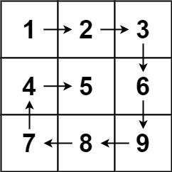
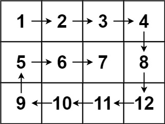

## Problem

Given an `m x n` `matrix`, return _all elements of the_ `matrix` _in spiral order_.

<https://leetcode.com/problems/spiral-matrix/>

**Example 1:**


{.invert-when-dark}

> Input: `matrix = [[1,2,3],[4,5,6],[7,8,9]]`\
> Output: `[1,2,3,6,9,8,7,4,5]`

**Example 2:**


{.invert-when-dark}

> Input: `matrix = [[1,2,3,4],[5,6,7,8],[9,10,11,12]]`\
> Output: `[1,2,3,4,8,12,11,10,9,5,6,7]`

**Constraints:**

- `m == matrix.length`
- `n == matrix[i].length`
- `1 <= m, n <= 10`
- `-100 <= matrix[i][j] <= 100`

## Test Cases

```python
class Solution:
    def spiralOrder(self, matrix: List[List[int]]) -> List[int]:
```



## Thoughts

主要就是注意控制好边界。

## Code


