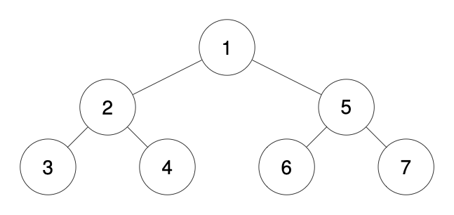
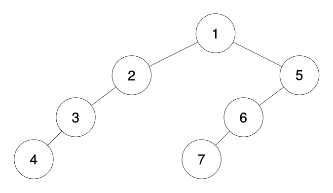

## Problem

We run a preorder depth-first search (DFS) on the `root` of a binary tree.

At each node in this traversal, we output `D` dashes (where `D` is the depth of this node), then we output the value of this node.  If the depth of a node is `D`, the depth of its immediate child is `D + 1`.  The depth of the `root` node is `0`.

If a node has only one child, that child is guaranteed to be **the left child**.

Given the output `traversal` of this traversal, recover the tree and return _its_ `root`.

<https://leetcode.com/problems/recover-a-tree-from-preorder-traversal/>

**Example 1:**





> Input: `traversal = "1-2--3--4-5--6--7"`
> Output: `[1,2,5,3,4,6,7]`

**Example 2:**





> Input: `traversal = "1-2--3---4-5--6---7"`
> Output: `[1,2,5,3,null,6,null,4,null,7]`

**Example 3:**





> Input: `traversal = "1-401--349---90--88"`
> Output: `[1,401,null,349,88,90]`

**Constraints:**

- The number of nodes in the original tree is in the range `[1, 1000]`.
- `1 <= Node.val <= 10⁹`

## Test Cases

``` python
# Definition for a binary tree node.
# class TreeNode:
#     def __init__(self, val=0, left=None, right=None):
#         self.val = val
#         self.left = left
#         self.right = right
class Solution:
    def recoverFromPreorder(self, traversal: str) -> Optional[TreeNode]:
```



## Thoughts

先对 traversal 字符串做预处理，把信息解析出来，得到一个数组，数组中每一项是个二元组即 `(level, val)`，其中 val 就是对应的数字，level 是数字前边 `-` 的个数（即对应节点在二叉树的深度）。最简单的办法就是直接按 `-` 把 traversal 分段，除了第一个数字之外，每个数字左边的空字符串数量即为 `level - 1`。也可以像 [224. Basic Calculator](224-basic-calculator) 那样写一个专门的 tokenizer，用移动下标进行处理。

在构造二叉树的时候，用一个栈记录下从根节点到新节点的路径，以便能够快速回退到某个祖先节点。根据路径的长度（栈中节点的个数）可以知道栈顶节点在二叉树中的深度，对于从 traversal 解析到的下一对 `(level, val)`，如果 level 小于路径长度，则把多余的节点依次弹出，直到栈顶节点的深度是 `level - 1`，此即新节点的父节点。因为题目限定，如果只有一个子节点，该子节点为左子节点，所以只需要判断栈顶节点是否有左子节点，以此来确定新节点是添加到哪里。

时间复杂度 `O(n)`，空间复杂度 `O(n)`（主要是处理 traversal 用的，如果不用 split 而是完全流式处理，可以用 `O(1)` 空间完成 traversal 处理，而总的空间复杂度为 `O(h)`，其中 h 是二叉树的深度）。

## Code



Test cases for solution inner methods:


