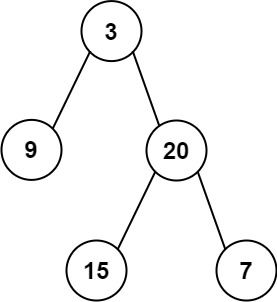

## Problem

Given two integer arrays `preorder` and `inorder` where `preorder` is the preorder traversal of a binary tree and `inorder` is the inorder traversal of the same tree, construct and return _the binary tree_.

<https://leetcode.com/problems/construct-binary-tree-from-preorder-and-inorder-traversal/>

**Example 1:**





> Input: `preorder = [3,9,20,15,7], inorder = [9,3,15,20,7]`
> Output: `[3,9,20,null,null,15,7]`

**Example 2:**

> Input: `preorder = [-1], inorder = [-1]`
> Output: `[-1]`

**Constraints:**

- `1 <= preorder.length <= 3000`
- `inorder.length == preorder.length`
- `-3000 <= preorder[i], inorder[i] <= 3000`
- `preorder` and `inorder` consist of **unique** values.
- Each value of `inorder` also appears in `preorder`.
- `preorder` is **guaranteed** to be the preorder traversal of the tree.
- `inorder` is **guaranteed** to be the inorder traversal of the tree.

## Test Cases

``` python
# Definition for a binary tree node.
# class TreeNode:
#     def __init__(self, val=0, left=None, right=None):
#         self.val = val
#         self.left = left
#         self.right = right
class Solution:
    def buildTree(self, preorder: List[int], inorder: List[int]) -> Optional[TreeNode]:
```



## Thoughts

前序（pre-order，NLR），中序（in-order，LNR）。

``` text
NLR: N-LEFTSUBTREE-RIGHTSUBTREE
     ╰-----------╮
LNR: LEFTSUBTREE-N-RIGHTSUBTREE
```

NLR 第一个数就是整棵二叉树的根节点，而 LNR 第一个数是整棵二叉树最靠左的节点。NLR 从第一个数字开始，直到遇见 LNR 第一个数字，应该就是从根节点到最左节点的路径。

例子：

``` text
NLR: 3, 4, 1, 6, 7, 2, 0, 5
LNR: 1, 7, 6, 4, 0, 2, 3, 5
```

显然 NLR 的前三个数字 3、4、1 是最左的一条路径，且 1 没有左子节点。为了遍于之后能够再找到 3、4、1 并设置它们的右子节点，需要在遇到的时候就压入栈。

``` text
           ↓
NLR: 3, 4, 1, 6, 7, 2, 0, 5
LNR: 1, 7, 6, 4, 0, 2, 3, 5
     ↑
```





NLR 的下一个数字 6，LNR 的下一个数字 7，二者不一样，说明 6 是一棵子树的树根，7 是这棵子树的最左节点。而 6 的父节点应该就是当前栈里的最后一个节点 1。注意栈里的节点都是待确定右子节点的，所以 6 是 1 的右子节点（一旦确定了右子节点就可以出栈了）。

继续扫描 NLR 直到遇见 7，组成从 6 到 7 的一条左路径（这里没有其他中间节点了）。

``` text
                 ↓
NLR: 3, 4, 1, 6, 7, 2, 0, 5
LNR: 1, 7, 6, 4, 0, 2, 3, 5
        ↑
```





LNR 的下一个数字是 6，是栈里倒数第二个数字（即 7 的父节点），说明 7 没有右子节点，只需要把 7 出栈即可。同理再下一个数字是 4，也是栈里倒数第二个数字，说明 6 也没有右子节点，直接出栈。

``` text
                 ↓
NLR: 3, 4, 1, 6, 7, 2, 0, 5
LNR: 1, 7, 6, 4, 0, 2, 3, 5
              ↑
```





然后 NLR 的 2、0 以及 LNR 的 0 也是类似，说明 2 是 4（栈里最后一个节点）的右子节点，0 是 2 的左子节点。

``` text
                       ↓
NLR: 3, 4, 1, 6, 7, 2, 0, 5
LNR: 1, 7, 6, 4, 0, 2, 3, 5
                 ↑
```





LNR 后边的数字 2、3，分别说明栈里最后的 0、2 都没有右子节点，直接出栈。

最后 NLR 和 LNR 的数字都是 5，说明这是没有左子节点的树根，并且是 3（栈里最后一个节点）的右子节点。

``` text
                          ↓
NLR: 3, 4, 1, 6, 7, 2, 0, 5
LNR: 1, 7, 6, 4, 0, 2, 3, 5
                          ↑
```





NLR 和 LNR 都遍历结束，所有节点都添加完毕。这时候唯一要做的是找到整棵二叉树的根节点。一个简单的办法是事先准备一个虚的初始节点，在遍历结束的时候，该初始节点的左子节点就是二叉树的根节点。

根据上边例子，整理出构建二叉树的处理逻辑：

1. 从 `i = 0`、`j = 0` 开始扫描 NLR 和 LNR。令当前根节点为虚拟初始节点。
2. 如果 `LNR[j]` 等于栈里倒数第二个节点的值，把栈的最后一个节点出栈（它没有右子节点），右移 j。
3. 否则：
   1. 创建节点，其值为 `NLR[i]`。
   2. 如果当前根节点不为空，将新节点记为其左子节点；否则弹出栈的最后一个节点，将新节点记为其右子节点。
   3. 新节点入栈。
   4. 右移 i。
   5. 如果新节点的值等于 `LNR[j]`，则右移 j，置当前根节点为空。否则置当前根节点为新节点。
4. 回到 2 重复，直到 NLR 扫描完成。

## Code


