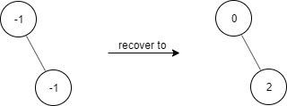
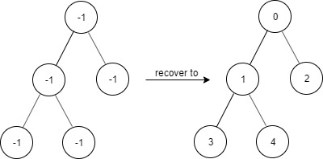
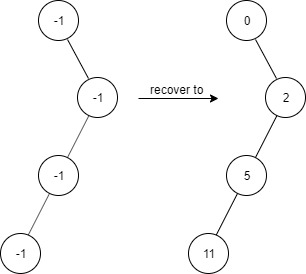

## Problem

Given a binary tree with the following rules:

1. `root.val == 0`
2. For any `treeNode`:
   1. If `treeNode.val` has a value `x` and `treeNode.left != null`, then `treeNode.left.val == 2 * x + 1`
   2. If `treeNode.val` has a value `x` and `treeNode.right != null`, then `treeNode.right.val == 2 * x + 2`

Now the binary tree is contaminated, which means all `treeNode.val` have been changed to `-1`.

Implement the `FindElements` class:

- `FindElements(TreeNode* root)` Initializes the object with a contaminated binary tree and recovers it.
- `bool find(int target)` Returns `true` if the `target` value exists in the recovered binary tree.

<https://leetcode.com/problems/find-elements-in-a-contaminated-binary-tree/>

**Example 1:**





> Input
> `["FindElements","find","find"]`
> `[[[-1,null,-1]],[1],[2]]`
> Output
> `[null,false,true]`
> Explanation
>
> ``` cpp
> FindElements findElements = new FindElements([-1,null,-1]);
> findElements.find(1); // return False
> findElements.find(2); // return True
> ```

**Example 2:**





> Input
> `["FindElements","find","find","find"]`
> `[[[-1,-1,-1,-1,-1]],[1],[3],[5]]`
> Output
> `[null,true,true,false]`
> Explanation
>
> ``` cpp
> FindElements findElements = new FindElements([-1,-1,-1,-1,-1]);
> findElements.find(1); // return True
> findElements.find(3); // return True
> findElements.find(5); // return False
> ```

**Example 3:**





> Input
> `["FindElements","find","find","find","find"]`
> `[[[-1,null,-1,-1,null,-1]],[2],[3],[4],[5]]`
> Output
> `[null,true,false,false,true]`
> Explanation
>
> ``` cpp
> FindElements findElements = new FindElements([-1,null,-1,-1,null,-1]);
> findElements.find(2); // return True
> findElements.find(3); // return False
> findElements.find(4); // return False
> findElements.find(5); // return True
> ```

**Constraints:**

- `TreeNode.val == -1`
- The height of the binary tree is less than or equal to `20`
- The total number of nodes is between `[1, 10⁴]`
- Total calls of `find()` is between `[1, 10⁴]`
- `0 <= target <= 10⁶`

## Test Cases

``` python
# Definition for a binary tree node.
# class TreeNode:
#     def __init__(self, val=0, left=None, right=None):
#         self.val = val
#         self.left = left
#         self.right = right
class FindElements:

    def __init__(self, root: Optional[TreeNode]):


    def find(self, target: int) -> bool:


# Your FindElements object will be instantiated and called as such:
# obj = FindElements(root)
# param_1 = obj.find(target)
```



## Thoughts

## Code

这个二叉树的值的排列跟堆的各节点数组下标是一致的，每个节点的左子节点的数字都是奇数，右子节点的数字都是偶数，对于值为 x 的节点，其父节点的值为 `⌊(x-1) / 2⌋`。

对于给定的 target，可以计算出它的所有祖先节点的值，并且对于每一个祖先节点可以知道该节点是其父节点的左子节点还是右子节点，由此可以计算出从根节点开始找到 target 应该走的路径。那么从根节点开始，沿着这条路径往下找，看是否每个节点都存在，如果有某个节点不存在，则说明 target 不存在于二叉树中。

这个方法牺牲时间节省空间，构造函数的时间复杂度 `O(1)`，`find` 方法的时间复杂度 `O(h)`，空间复杂度 `O(h)`，其中 h 是二叉树的平均深度，`O(h) ≈ O(log n)`。

如果 `find` 的调用次数很多，可以选择牺牲空间以节省时间。可以在构造函数中把二叉树包含的所有数字都存在哈希集合中，`find` 的时候直接查一下。通过遍历二叉树，按照节点值的构造规则，即可枚举出所有节点的值。构造函数时间复杂度 `O(n)`，`find` 方法时间复杂度 `O(1)`，空间复杂度 `O(n)`。

### Less Space



### Less Time


