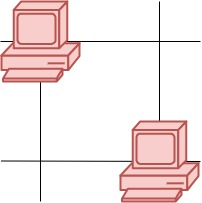
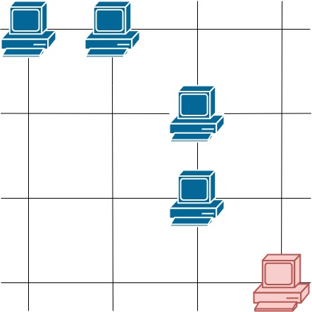

## Problem

You are given a map of a server center, represented as a `m * n` integer matrix `grid`, where 1 means that on that cell there is a server and 0 means that it is no server. Two servers are said to communicate if they are on the same row or on the same column.

Return the number of servers that communicate with any other server.

<https://leetcode.com/problems/count-servers-that-communicate/>

**Example 1:**





> Input: `grid = [[1,0],[0,1]]`
> Output: `0`
> Explanation: No servers can communicate with others.

**Example 2:**





> Input: `grid = [[1,0],[1,1]]`
> Output: `3`
> Explanation: All three servers can communicate with at least one other server.

**Example 3:**





> Input: `grid = [[1,1,0,0],[0,0,1,0],[0,0,1,0],[0,0,0,1]]`
> Output: `4`
> Explanation: The two servers in the first row can communicate with each other. The two servers in the third column can communicate with each other. The server at right bottom corner can't communicate with any other server.

**Constraints:**

- `m == grid.length`
- `n == grid[i].length`
- `1 <= m <= 250`
- `1 <= n <= 250`
- `grid[i][j] == 0 or 1`

## Test Cases

``` python
class Solution:
    def countServers(self, grid: List[List[int]]) -> int:
```



## Thoughts

检查每一台服务器，如果同行或同列的服务器数量超过 1，则计数。

为了减少重复的扫描，可以先扫描一遍 grid，记录每一行的服务器数量。

然后逐列检查，统计一列内服务器数量，如果大于 1，则所有这些服务器都可以计数。如果只有 1 台，则看其所在的行，看刚才记录的此行的服务器总数是否大于 1 即可。

时间复杂度 `O(m * n)`，空间复杂度 `O(m)`。

## Code


