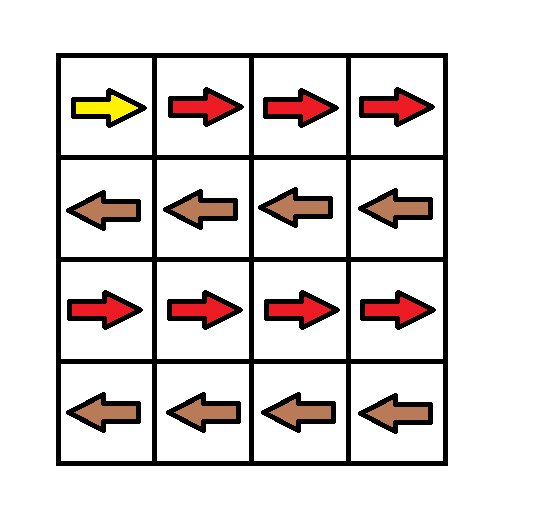
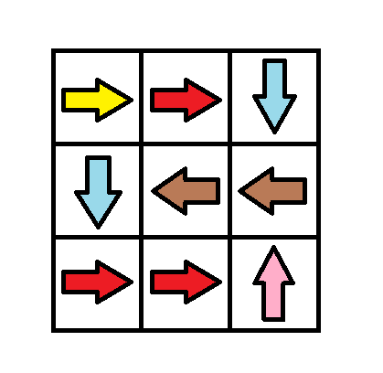
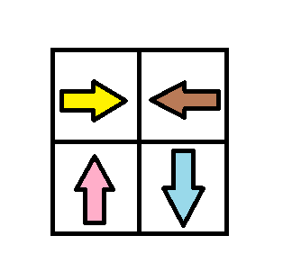

## Problem

Given an `m x n` grid. Each cell of the grid has a sign pointing to the next cell you should visit if you are currently in this cell. The sign of `grid[i][j]` can be:

- `1` which means go to the cell to the right. (i.e go from `grid[i][j]` to `grid[i][j + 1]`)
- `2` which means go to the cell to the left. (i.e go from `grid[i][j]` to `grid[i][j - 1]`)
- `3` which means go to the lower cell. (i.e go from `grid[i][j]` to `grid[i + 1][j]`)
- `4` which means go to the upper cell. (i.e go from `grid[i][j]` to `grid[i - 1][j]`)

Notice that there could be some signs on the cells of the grid that point outside the grid.

You will initially start at the upper left cell `(0, 0)`. A valid path in the grid is a path that starts from the upper left cell `(0, 0)` and ends at the bottom-right cell `(m - 1, n - 1)` following the signs on the grid. The valid path does not have to be the shortest.

You can modify the sign on a cell with `cost = 1`. You can modify the sign on a cell **one time only**.

Return _the minimum cost to make the grid have at least one valid path_.

<https://leetcode.com/problems/minimum-cost-to-make-at-least-one-valid-path-in-a-grid/>

**Example 1:**





> Input: `grid = [[1,1,1,1],[2,2,2,2],[1,1,1,1],[2,2,2,2]]`
> Output: `3`
> Explanation: You will start at point `(0, 0)`.
> The path to `(3, 3)` is as follows. `(0, 0) --> (0, 1) --> (0, 2) --> (0, 3)` change the arrow to down with `cost = 1 --> (1, 3) --> (1, 2) --> (1, 1) --> (1, 0)` change the arrow to down with `cost = 1 --> (2, 0) --> (2, 1) --> (2, 2) --> (2, 3)` change the arrow to down with `cost = 1 --> (3, 3)`
> The total `cost = 3`.

**Example 2:**





> Input: `grid = [[1,1,3],[3,2,2],[1,1,4]]`
> Output: `0`
> Explanation: You can follow the path from `(0, 0)` to `(2, 2)`.

**Example 3:**





> Input: `grid = [[1,2],[4,3]]`
> Output: `1`

**Constraints:**

- `m == grid.length`
- `n == grid[i].length`
- `1 <= m, n <= 100`
- `1 <= grid[i][j] <= 4`

## Test Cases

``` python
class Solution:
    def minCost(self, grid: List[List[int]]) -> int:
```



## Thoughts

跟 [2290. Minimum Obstacle Removal to Reach Corner](2290-minimum-obstacle-removal-to-reach-corner) 和 [2577. Minimum Time to Visit a Cell In a Grid](2577-minimum-time-to-visit-a-cell-in-a-grid) 类似，定义好边的权重即可。

如果边 `(u, v)` 的方向跟格子 u 的箭头方向一致，则权重为 0，否则权重为 1。

然后用 Dijkstra 算法计算左上角顶点到右下角顶点的最短距离，此距离即为所求 cost。

时间复杂度同样是 `O(m*n log (m*n))`。

## Code


