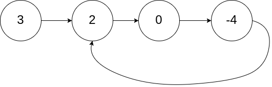
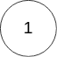

## Problem

Given `head`, the head of a linked list, determine if the linked list has a cycle in it.

There is a cycle in a linked list if there is some node in the list that can be reached again by continuously following the `next` pointer. Internally, `pos` is used to denote the index of the node that tail's `next` pointer is connected to. **Note that `pos` is not passed as a parameter**.

Return `true` _if there is a cycle in the linked list_. Otherwise, return `false`.

<https://leetcode.com/problems/linked-list-cycle/>

**Example 1:**

{.invert-when-dark}

> Input: `head = [3,2,0,-4], pos = 1`
> Output: `true`
> Explanation: There is a cycle in the linked list, where the tail connects to the 1st node (0-indexed).

**Example 2:**

{.invert-when-dark}

> Input: `head = [1,2], pos = 0`
> Output: `true`
> Explanation: There is a cycle in the linked list, where the tail connects to the 0th node.

**Example 3:**

{.invert-when-dark}

> Input: `head = [1], pos = -1`
> Output: `false`
> Explanation: There is no cycle in the linked list.

**Constraints:**

- The number of the nodes in the list is in the range `[0, 10⁴]`.
- `-10⁵ <= Node.val <= 10⁵`
- `pos` is `-1` or a **valid index** in the linked-list.

**Follow up:** Can you solve it using `O(1)` (i.e. constant) memory?

## Test Cases

```python
# Definition for singly-linked list.
# class ListNode:
#     def __init__(self, x):
#         self.val = x
#         self.next = None

class Solution:
    def hasCycle(self, head: Optional[ListNode]) -> bool:
```



## Thoughts

经典问题，用两个步长不等的指针遍历链表。如果没有环，较快的指针会先走到链表末尾。如果有环，二者一定会相遇。

空间复杂度 `O(1)`。

设指针 p1 步长为 1，p2 步长为 2。如果链表有环，易知 p1 在环里转满一圈之前，必然会与 p2 相遇。

设环长为 m。p1 进入环时，p2 在 p1 前方第 k 个节点处（0 < k < m）。设经过 s 次移动，p1 和 p2 相遇，显然有 $0+s\equiv k+2s\pmod{m}$，易得 s = m - k。

所以时间复杂度是 `O(n)`。

## Code


