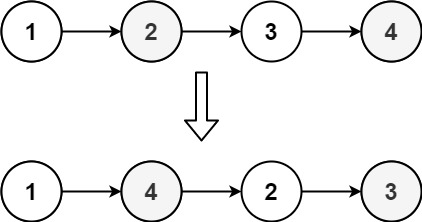
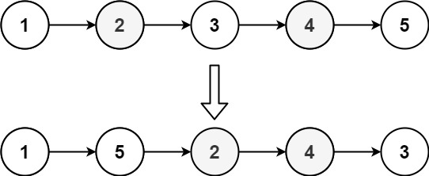

## Problem

You are given the head of a singly linked-list. The list can be represented as:

> L0 → L1 → … → Ln - 1 → Ln

_Reorder the list to be on the following form:_

> L0 → Ln → L1 → Ln - 1 → L2 → Ln - 2 → …

You may not modify the values in the list's nodes. Only nodes themselves may be changed.

<https://leetcode.com/problems/reorder-list/>

**Example 1:**





> Input: `head = [1,2,3,4]`
> Output: `[1,4,2,3]`

**Example 2:**





> Input: `head = [1,2,3,4,5]`
> Output: `[1,5,2,4,3]`

**Constraints:**

- The number of nodes in the list is in the range `[1, 5 * 10⁴]`.
- `1 <= Node.val <= 1000`

## Test Cases

``` python
# Definition for singly-linked list.
# class ListNode:
#     def __init__(self, val=0, next=None):
#         self.val = val
#         self.next = next
class Solution:
    def reorderList(self, head: Optional[ListNode]) -> None:
        """
        Do not return anything, modify head in-place instead.
        """
```



## Thoughts

类似于翻转单链表。

先找到链表右半段的起点。用两个指针 p1 和 p2，从链表头开始，p1 每次走一步，p2 每次走两步。当 p2 走到链表终点时，p1 指在中间位置，也就是需要翻转的子链表的起点。

> 注意奇偶数长度的差异。每次可以先让 p2 走一步，如果没到头就让 p1、p2 再各走一步，否则就不动 p1 了。当 p2 走到头时，p1.next 是需要翻转的部分的第一个节点。

然后翻转右半段链表，直接一次遍历逐个节点翻转。

最后把两个半条链表归并串联起来。

## Code


