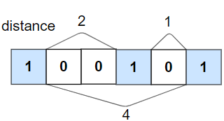

## Problem

Given an binary array `nums` and an integer `k`, return `true` _if all_ `1`_'s are at least_ `k` _places away from each other, otherwise return_ `false`.

<https://leetcode.com/problems/check-if-all-1s-are-at-least-length-k-places-away/>

**Example 1:**





> Input: `nums = [1,0,0,0,1,0,0,1], k = 2`
> Output: `true`
> Explanation: Each of the 1s are at least 2 places away from each other.

**Example 2:**





> Input: `nums = [1,0,0,1,0,1], k = 2`
> Output: `false`
> Explanation: The second 1 and third 1 are only one apart from each other.

**Constraints:**

- `1 <= nums.length <= 10⁵`
- `0 <= k <= nums.length`
- `nums[i]` is `0` or `1`

## Test Cases

``` python
class Solution:
    def kLengthApart(self, nums: List[int], k: int) -> bool:
```



## Thoughts

如果位置 i 的数字是 `1`，那么最近的下一个可以是 `1` 的位置是 `pos = i + k + 1`，如果从 `i + 1` 到 `pos - 1` 中有任何位置是 `1` 则返回 false。

## Code


