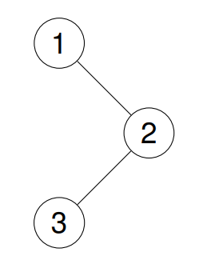

## Problem

Given the `root` of a binary tree, return _the postorder traversal of its nodes' values_.

<https://leetcode.com/problems/binary-tree-postorder-traversal/>

**Example 1:**

> Input: `root = [1,null,2,3]`
> Output: `[3,2,1]`
> Explanation:
> 



**Example 2:**

> Input: `root = [1,2,3,4,5,null,8,null,null,6,7,9]`
> Output: `[4,6,7,5,2,9,8,3,1]`
> Explanation:
> 



**Example 3:**

> Input: `root = []`
> Output: `[]`

**Example 4:**

> Input: `root = [1]`
> Output: `[1]`

**Constraints:**

- The number of the nodes in the tree is in the range `[0, 100]`.
- `-100 <= Node.val <= 100`

**Follow up:** Recursive solution is trivial, could you do it iteratively?

## Test Cases

``` python
# Definition for a binary tree node.
# class TreeNode:
#     def __init__(self, val=0, left=None, right=None):
#         self.val = val
#         self.left = left
#         self.right = right
class Solution:
    def postorderTraversal(self, root: Optional[TreeNode]) -> List[int]:
```



## Thoughts

在 [124. Binary Tree Maximum Path Sum](124-binary-tree-maximum-path-sum) 或 [337. House Robber III](337-house-robber-iii) 中都用到了基于栈的非递归后序遍历二叉树。

## Code


