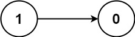
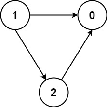

## Problem

There are a total of `numCourses` courses you have to take, labeled from `0` to `numCourses - 1`. You are given an array `prerequisites` where `prerequisites[i] = [aᵢ, bᵢ]` indicates that you **must** take course `aᵢ` first if you want to take course `bᵢ`.

- For example, the pair `[0, 1]` indicates that you have to take course `0` before you can take course `1`.

Prerequisites can also be **indirect**. If course `a` is a prerequisite of course `b`, and course `b` is a prerequisite of course `c`, then course `a` is a prerequisite of course `c`.

You are also given an array `queries` where `queries[j] = [uⱼ, vⱼ]`. For the `jᵗʰ` query, you should answer whether course `uⱼ` is a prerequisite of course `vⱼ` or not.

Return _a boolean array_ `answer`_, where_ `answer[j]` _is the answer to the_ `jᵗʰ` _query._

<https://leetcode.com/problems/course-schedule-iv/>

**Example 1:**





> Input: `numCourses = 2, prerequisites = [[1,0]], queries = [[0,1],[1,0]]`
> Output: `[false,true]`
> Explanation: The pair `[1, 0]` indicates that you have to take course 1 before you can take course 0.
> Course 0 is not a prerequisite of course 1, but the opposite is true.

**Example 2:**

> Input: `numCourses = 2, prerequisites = [], queries = [[1,0],[0,1]]`
> Output: `[false,false]`
> Explanation: There are no prerequisites, and each course is independent.

**Example 3:**





> Input: `numCourses = 3, prerequisites = [[1,2],[1,0],[2,0]], queries = [[1,0],[1,2]]`
> Output: `[true,true]`

**Constraints:**

- `2 <= numCourses <= 100`
- `0 <= prerequisites.length <= (numCourses * (numCourses - 1) / 2)`
- `prerequisites[i].length == 2`
- `0 <= aᵢ, bᵢ <= numCourses - 1`
- `aᵢ != bᵢ`
- All the pairs `[aᵢ, bᵢ]` are **unique**.
- The prerequisites graph has no cycles.
- `1 <= queries.length <= 10⁴`
- `0 <= uᵢ, vᵢ <= numCourses - 1`
- `uᵢ != vᵢ`

## Test Cases

``` python
class Solution:
    def checkIfPrerequisite(self, numCourses: int, prerequisites: List[List[int]], queries: List[List[int]]) -> List[bool]:
```



## Thoughts

系列题：

- [207. Course Schedule](207-course-schedule)
- [1462. Course Schedule IV](1462-course-schedule-iv)

跟 [207. Course Schedule](207-course-schedule) 类似，用有向图来表示课程之间的依赖关系。图中的任意两个顶点 u 和 v 各自代表一个课程，如果 u 是 v 的直接前置依赖课程，则作有向边 `(u, v)`。

用 `dp(u)` 表示课程 u 的所有（直接和间接）下游课程的集合，易得

$$
dp(u)=\{v|\exist\text{ edge}(u, v)\}\cup\bigcup_{v}{dp(v)}
$$

也就是 u 的直接下游课程集合 `{v}`，以及所有 `dp(v)` 的并集。

一种方式利用拓扑排序，从最下游课程开始计算，这样计算任意 `dp(u)` 的时候，其直接下游的所有 v 的 dp 值都已经有了。

也可以直接按任意顺序，但只对未计算过的 v 进行递归。

时间复杂度 `O(n²)`，空间复杂度 `O(n²)`。

## Code


