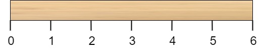
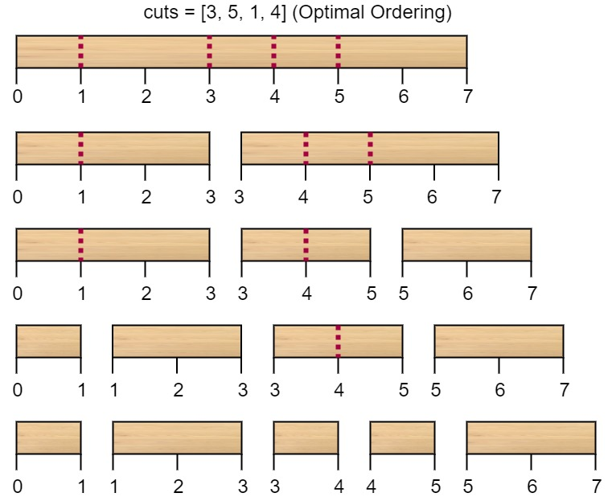
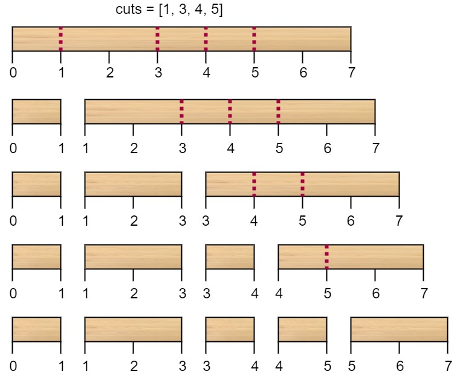

## Problem

Given a wooden stick of length `n` units. The stick is labelled from `0` to `n`. For example, a stick of length **6** is labelled as follows:





Given an integer array `cuts` where `cuts[i]` denotes a position you should perform a cut at.

You should perform the cuts in order, you can change the order of the cuts as you wish.

The cost of one cut is the length of the stick to be cut, the total cost is the sum of costs of all cuts. When you cut a stick, it will be split into two smaller sticks (i.e. the sum of their lengths is the length of the stick before the cut). Please refer to the first example for a better explanation.

Return _the minimum total cost_ of the cuts.

<https://leetcode.cn/problems/minimum-cost-to-cut-a-stick/>

**Example 1:**





> Input: `n = 7, cuts = [1,3,4,5]`
> Output: `16`
> Explanation: Using cuts `order = [1, 3, 4, 5]` as in the input leads to the following scenario:
> 


> The first cut is done to a rod of length 7 so the cost is 7. The second cut is done to a rod of length 6 (i.e. the second part of the first cut), the third is done to a rod of length 4 and the last cut is to a rod of length 3. The total cost is `7 + 6 + 4 + 3 = 20`.
> Rearranging the cuts to be `[3, 5, 1, 4]` for example will lead to a scenario with total cost = 16 (as shown in the example photo `7 + 4 + 3 + 2 = 16`).

**Example 2:**

> Input: `n = 9, cuts = [5,6,1,4,2]`
> Output: `22`
> Explanation: If you try the given cuts ordering the cost will be 25.
> There are much ordering with total cost <= 25, for example, the order `[4, 6, 5, 2, 1]` has total cost = 22 which is the minimum possible.

**Constraints:**

- `2 <= n <= 10⁶`
- `1 <= cuts.length <= min(n - 1, 100)`
- `1 <= cuts[i] <= n - 1`
- All the integers in `cuts` array are **distinct**.

## Test Cases

``` python
class Solution:
    def minCost(self, n: int, cuts: List[int]) -> int:
```



## Thoughts

典型的动态规划问题。

设一共有 m 个切割点，从左到右分别记为 $1,2,\dots,m$，在木棍上的位置分别为 $0=k_0<k_1<k_2<\dots<k_m<k_{m+1}=n$（计木棍的左端点为 0 号切割点，右端点为 m + 1 号切割点）。

任取两个切割点 p、q（$0\le p<q\le m+1$），以它俩为左右端点的子木棍的最小切割成本记为 $cost_{p,q}$。

$$
cost_{p,q}=\begin{cases}
(k_q-k_p)+\min_{p<r<q}(cost_{p,r}+cost_{r,q}) & \text{ if } q-p>1 \\
0 & \text{ otherwise }
\end{cases}
$$

如果直接按公式计算需要不断递归，且有大量重复计算，所以用二维数组缓存已知的 $cost_{p,q}$，空间复杂度为 `O(m²)`。

为确保 $cost_{p,q}$ 的值在需要的时候就已经计算好了，从间隔最小的 p、q 对（q - p = 2）开始。需要两层循环，且每一次需要遍历 p 和 q 之前的所有 r 值，总共时间复杂度为 `O(m³)`（开始时需要对输入的切割点排序，时间复杂度为 `O(m log m)`，可忽略）。

> 稍微节省一点儿空间：因为 $\forall q,cost_{m+1,q}$ 和 $\forall p,cost_{p,0}$ 完全用不上，保存 $cost_{p,q}$ 的二维数组可以去掉 `p = m + 1` 的行和 `q = 0` 的列。

## Code


