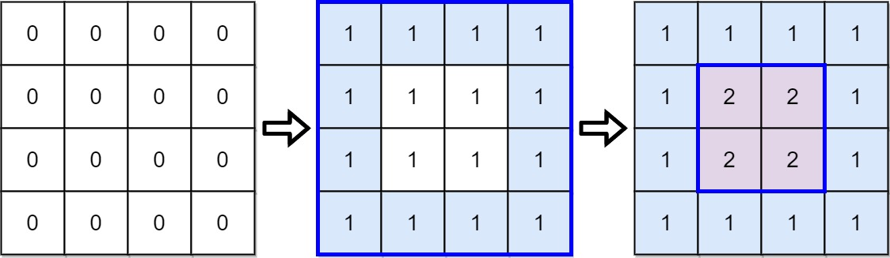
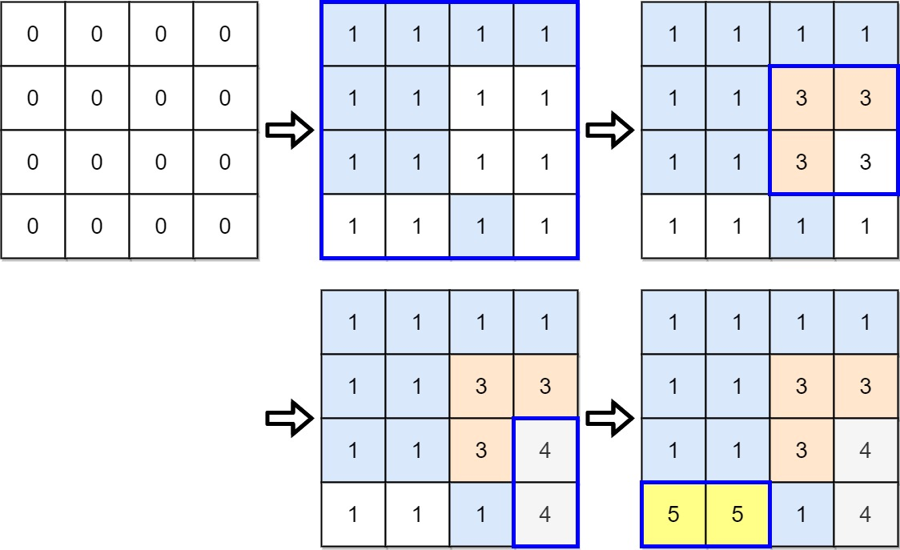

## Problem

There is a strange printer with the following two special requirements:

- On each turn, the printer will print a solid rectangular pattern of a single color on the grid. This will cover up the existing colors in the rectangle.
- Once the printer has used a color for the above operation, **the same color cannot be used again**.

You are given a `m x n` matrix `targetGrid`, where `targetGrid[row][col]` is the color in the position `(row, col)` of the grid.

Return `true` _if it is possible to print the matrix_ `targetGrid`_,_ _otherwise, return_ `false`.

<https://leetcode.com/problems/strange-printer-ii/>

**Example 1:**





> Input: `targetGrid = [[1,1,1,1],[1,2,2,1],[1,2,2,1],[1,1,1,1]]`
> Output: `true`

**Example 2:**





> Input: `targetGrid = [[1,1,1,1],[1,1,3,3],[1,1,3,4],[5,5,1,4]]`
> Output: `true`

**Example 3:**

> Input: `targetGrid = [[1,2,1],[2,1,2],[1,2,1]]`
> Output: `false`
> Explanation: It is impossible to form targetGrid because it is not allowed to print the same color in different turns.

**Constraints:**

- `m == targetGrid.length`
- `n == targetGrid[i].length`
- `1 <= m, n <= 60`
- `1 <= targetGrid[row][col] <= 60`

## Test Cases

``` python
class Solution:
    def isPrintable(self, targetGrid: List[List[int]]) -> bool:
```



## Thoughts

跟 [664. Strange Printer](664-strange-printer) 似乎没有太大关联，除了都是「打印机」。

对于任何一个颜色，找到能围住所有该颜色格子的最小矩形区域，在打印该颜色的时候，这个区域是最小的需要打印的范围。如果这个区域内有其他的颜色，那么那些颜色就都要在之后再打印。

作一个有向图图，顶点是所有的颜色。如果颜色 v 需要在颜色 u 之后打印，就画一条 u 到 v 的有向边。检查图中是否存在环，存在则无法成功打印。

判定图中是否有环可以参考 [207. Course Schedule](207-course-schedule)，采用的方法是任取一个节点，从它出发做深度遍历，如果当前路径上的节点被再次访问到，说明有环。

另外一种方式是在图中找任意一个入度为 0 的点，将其及其相连的边都删除（它的后继节点的入度减一）。持续操作，如果最后剩下若干个节点，入度均大于 0，就说明有环。

整体很慢啊，设一共有 k 个颜色，构造图的时间是 `O(m * n * k)`，判断是否有环的时间是 `O(k²)`。

## Code



## Faster

更直接的方式先找需要最后打印的颜色。显然如果一个颜色的包围矩形内每个格子都是这个颜色，那么它应该最后被打印。

一种方式是在第一遍扫描的时候，记录每个颜色占用的格子数量，判断此数量是否与包围矩形的面积相等。另一种方式是直接扫描包围矩形中的所有格子，检查每个格子的颜色。

确定了可以最后打印的颜色之后，它原本占用的那些格子在打印该颜色之前是可以随意打印的。

一种方式是对于该颜色的每一个格子，所有包含该格子的其他颜色的包围矩形，需要打印的面积减一（或者让另外那种颜色的格子数量加一）。另一种方式是将该格子标记为镂空（比如将颜色设置为 0），一个包围矩形中镂空的格子对是否可打印没有影响。

这样不断寻找可以后打印的颜色，如果最后剩下几个颜色，哪一个都无法（在这几个颜色的）最后打印，就说明整个 `targetGrid` 无法打印。

最坏情况时间复杂度都是 `O(m * n * k²)`。





> 实际提交之后的运行时间，`solution.py > solution2.py > solution3.py`（基本都是差 3 倍），但时间复杂度都差不多。尤其 solution2 和 solution3 哪个跑得快，跟测试用例的情况也有较大关系。
