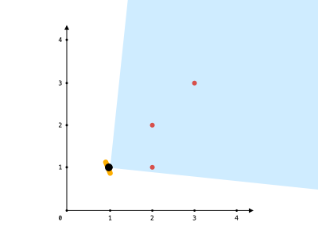
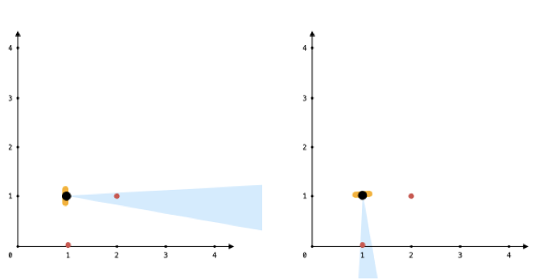

## Problem

You are given an array `points`, an integer `angle`, and your `location`, where `location = [pos_x, pos_y]` and `points[i] = [x_i, y_i]` both denote **integral coordinates** on the X-Y plane.

Initially, you are facing directly east from your position. You **cannot move** from your position, but you can **rotate**. In other words, `pos_x` and `pos_y` cannot be changed. Your field of view in **degrees** is represented by `angle`, determining how wide you can see from any given view direction. Let `d` be the amount in degrees that you rotate counterclockwise. Then, your field of view is the **inclusive** range of angles `[d - angle/2, d + angle/2]`.



You can **see** some set of points if, for each point, the **angle** formed by the point, your position, and the immediate east direction from your position is **in your field of view**.

There can be multiple points at one coordinate. There may be points at your location, and you can always see these points regardless of your rotation. Points do not obstruct your vision to other points.

Return _the maximum number of points you can see_.

<https://leetcode.com/problems/maximum-number-of-visible-points/>

**Example 1:**





> Input: `points = [[2,1],[2,2],[3,3]], angle = 90, location = [1,1]`
> Output: `3`
> Explanation: The shaded region represents your field of view. All points can be made visible in your field of view, including `[3,3]` even though `[2,2]` is in front and in the same line of sight.

**Example 2:**

> Input: `points = [[2,1],[2,2],[3,4],[1,1]], angle = 90, location = [1,1]`
> Output: `4`
> Explanation: All points can be made visible in your field of view, including the one at your location.

**Example 3:**





> Input: `points = [[1,0],[2,1]], angle = 13, location = [1,1]`
> Output: `1`
> Explanation: You can only see one of the two points, as shown above.

**Constraints:**

- `1 <= points.length <= 10⁵`
- `points[i].length == 2`
- `location.length == 2`
- `0 <= angle < 360`
- `0 <= pos_x, pos_y, x_i, y_i <= 100`

## Test Cases

``` python
class Solution:
    def visiblePoints(self, points: List[List[int]], angle: int, location: List[int]) -> int:
```



## Thoughts

首先做坐标系变换，从原直角坐标系，变换到以 `location` 为原点的极坐标系。极坐标系下，一个点的坐标是 `(r, θ)`。对于 `r = 0` 的点，与观察者重合，始终都可以看得到，可以单独记录下有多少个。

> 根据直角坐标 `(x, y)` 计算极坐标 θ，用 [`math.atan2`](https://docs.python.org/3/library/math.html#math.atan2) 函数，其值域为 `(-π, π]`。

`r ≠ 0` 的所有点按 θ 排序，就是个滑动窗口的问题。

比一般滑动窗口稍微复杂一点儿的是数组是首尾相接的，而且每循环一次，所有的 θ 都要加上 `2 π`。用 Python 的话，`range(-n, n)` 刚好可以遍历数组两遍。

而且并不需要完整遍历两次，实际上只需要对旋转角度 d 取 `[0, 360° + angle]`（或者说 `[-360°, angle]`）即可。

另外像 [2779. Maximum Beauty of an Array After Applying Operation](2779-maximum-beauty-of-an-array-after-applying-operation) 最后提到的优化点，窗口在滑动过程中可以只增不减，用自身记录可行窗口的最大大小。

时间复杂度 `O(n log n)`，空间复杂度 `O(n)`。

## Code


