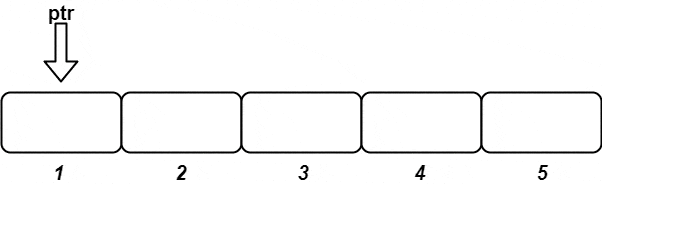

## Problem

There is a stream of `n` `(idKey, value)` pairs arriving in an **arbitrary** order, where `idKey` is an integer between `1` and `n` and `value` is a string. No two pairs have the same `id`.

Design a stream that returns the values in **increasing order of their IDs** by returning a **chunk** (list) of values after each insertion. The concatenation of all the **chunks** should result in a list of the sorted values.

Implement the `OrderedStream` class:

- `OrderedStream(int n)` Constructs the stream to take `n` values.
- `String[] insert(int idKey, String value)` Inserts the pair `(idKey, value)` into the stream, then returns the **largest possible chunk** of currently inserted values that appear next in the order.

<https://leetcode.cn/problems/design-an-ordered-stream/>

**Example 1:**





> Input
> `["OrderedStream", "insert", "insert", "insert", "insert", "insert"]`
> `[[5], [3, "ccccc"], [1, "aaaaa"], [2, "bbbbb"], [5, "eeeee"], [4, "ddddd"]]`
> Output
> `[null, [], ["aaaaa"], ["bbbbb", "ccccc"], [], ["ddddd", "eeeee"]]`
>
> Explanation
>
> ``` cpp
> // Note that the values ordered by ID is ["aaaaa", "bbbbb", "ccccc", "ddddd", "eeeee"].
> OrderedStream os = new OrderedStream(5);
> os.insert(3, "ccccc"); // Inserts (3, "ccccc"), returns [].
> os.insert(1, "aaaaa"); // Inserts (1, "aaaaa"), returns ["aaaaa"].
> os.insert(2, "bbbbb"); // Inserts (2, "bbbbb"), returns ["bbbbb", "ccccc"].
> os.insert(5, "eeeee"); // Inserts (5, "eeeee"), returns [].
> os.insert(4, "ddddd"); // Inserts (4, "ddddd"), returns ["ddddd", "eeeee"].
> // Concatentating all the chunks returned:
> // [] + ["aaaaa"] + ["bbbbb", "ccccc"] + [] + ["ddddd", "eeeee"] = ["aaaaa", "bbbbb", "ccccc", "ddddd", "eeeee"]
> // The resulting order is the same as the order above.
> ```

**Constraints:**

- `1 <= n <= 1000`
- `1 <= id <= n`
- `value.length == 5`
- `value` consists only of lowercase letters.
- Each call to `insert` will have a unique `id.`
- Exactly `n` calls will be made to `insert`.

## Test Cases

``` python
class OrderedStream:

    def __init__(self, n: int):


    def insert(self, idKey: int, value: str) -> List[str]:


# Your OrderedStream object will be instantiated and called as such:
# obj = OrderedStream(n)
# param_1 = obj.insert(idKey,value)
```



## Thoughts

用长度为 n 的数组用于记录 stream 的所有值，用一个遍历 ptr 记录下一次可以返回的 stream 部分的起始位置。每次 `insert` 的时候，先把给定的值存入给定的位置，如果 ptr 与该位置相同，则可以输出一部分内容（从 ptr 开始直到下一个为赋值的位置为止），否则直接返回空。

构造方法时间复杂度 `O(n)`，空间复杂度 `O(n)`。n 次调用 `insert` 方法，总的时间复杂度为 `O(n)`。

## Code


