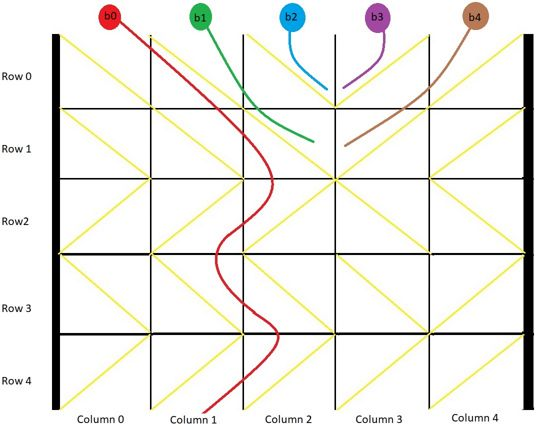

## Problem

You have a 2-D `grid` of size `m x n` representing a box, and you have `n` balls. The box is open on the top and bottom sides.

Each cell in the box has a diagonal board spanning two corners of the cell that can redirect a ball to the right or to the left.

- A board that redirects the ball to the right spans the top-left corner to the bottom-right corner and is represented in the grid as `1`.
- A board that redirects the ball to the left spans the top-right corner to the bottom-left corner and is represented in the grid as `-1`.

We drop one ball at the top of each column of the box. Each ball can get stuck in the box or fall out of the bottom. A ball gets stuck if it hits a "V" shaped pattern between two boards or if a board redirects the ball into either wall of the box.

Return _an array_ `answer` _of size_ `n` _where_ `answer[i]` _is the column that the ball falls out of at the bottom after dropping the ball from the_ `iᵗʰ` _column at the top, or `-1` _if the ball gets stuck in the box_._

<https://leetcode.cn/problems/where-will-the-ball-fall/>

**Example 1:**





> Input: `grid = [[1,1,1,-1,-1],[1,1,1,-1,-1],[-1,-1,-1,1,1],[1,1,1,1,-1],[-1,-1,-1,-1,-1]]`
> Output: `[1,-1,-1,-1,-1]`
> Explanation: This example is shown in the photo.
> Ball b0 is dropped at column 0 and falls out of the box at column 1.
> Ball b1 is dropped at column 1 and will get stuck in the box between column 2 and 3 and row 1.
> Ball b2 is dropped at column 2 and will get stuck on the box between column 2 and 3 and row 0.
> Ball b3 is dropped at column 3 and will get stuck on the box between column 2 and 3 and row 0.
> Ball b4 is dropped at column 4 and will get stuck on the box between column 2 and 3 and row 1.

**Example 2:**

> Input: `grid = [[-1]]`
> Output: `[-1]`
> Explanation: The ball gets stuck against the left wall.

**Example 3:**

> Input: `grid = [[1,1,1,1,1,1],[-1,-1,-1,-1,-1,-1],[1,1,1,1,1,1],[-1,-1,-1,-1,-1,-1]]`
> Output: `[0,1,2,3,4,-1]`

**Constraints:**

- `m == grid.length`
- `n == grid[i].length`
- `1 <= m, n <= 100`
- `grid[i][j]` is `1` or `-1`.

## Test Cases

``` python
class Solution:
    def findBall(self, grid: List[List[int]]) -> List[int]:
```



## Thoughts

直接用模拟法，模拟每个球的移动路径，计算出最终落到哪里。

如果一个球落入 grid 中某一行 row 的第 src 列，那么球会往 `dest = src + row[src]` 列滚动。但如果 dest 超出 `[0, n)` 区间，就会被左右边界挡住并停在那里。类似地，如果 `grid[dest] ≠ grid[src]`，说明形成了一个 "V"，也就停住了。其他情况，球会落入下一行的 dest 列，重复同样的判断直到球在某行被卡住或者从最后一行漏下去为止。

每个球最多需要 `O(m)` 时间。总共时间复杂度 `O(m * n)`，附加的空间复杂度 `O(1)`。

## Code


