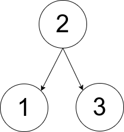
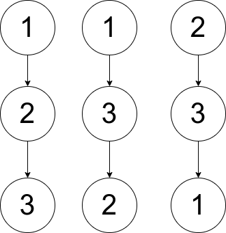

## Problem

You are given an array `pairs`, where `pairs[i] = [xᵢ, yᵢ]`, and:

- There are no duplicates.
- `xᵢ < yᵢ`

Let `ways` be the number of rooted trees that satisfy the following conditions:

- The tree consists of nodes whose values appeared in `pairs`.
- A pair `[xᵢ, yᵢ]` exists in `pairs` **if and only if** `xᵢ` is an ancestor of `yᵢ` or `yᵢ` is an ancestor of `xᵢ`.
- **Note:** the tree does not have to be a binary tree.

Two ways are considered to be different if there is at least one node that has different parents in both ways.

Return:

- `0` if `ways == 0`
- `1` if `ways == 1`
- `2` if `ways > 1`

A **rooted tree** is a tree that has a single root node, and all edges are oriented to be outgoing from the root.

An **ancestor** of a node is any node on the path from the root to that node (excluding the node itself). The root has no ancestors.

<https://leetcode.com/problems/number-of-ways-to-reconstruct-a-tree/>

**Example 1:**

{.invert-when-dark}

> Input: `pairs = [[1,2],[2,3]]`
> Output: `1`
> Explanation: There is exactly one valid rooted tree, which is shown in the above figure.

**Example 2:**

{.invert-when-dark}

> Input: `pairs = [[1,2],[2,3],[1,3]]`
> Output: `2`
> Explanation: There are multiple valid rooted trees. Three of them are shown in the above figures.

**Example 3:**

> Input: `pairs = [[1,2],[2,3],[2,4],[1,5]]`
> Output: `0`
> Explanation: There are no valid rooted trees.

**Constraints:**

- `1 <= pairs.length <= 10⁵`
- `1 <= xᵢ < yᵢ <= 500`
- The elements in `pairs` are unique.

## Test Cases

``` python
class Solution:
    def checkWays(self, pairs: List[List[int]]) -> int:
```



## Thoughts

首先根节点一定和所有其他节点都是 pair。设一共有 n 个节点，看是否存在某个数跟其他 `n - 1` 个数都是 pair，不存在则没有唯一的树根，返回 0。如果存在多个，说明这些数都可以作为树根，实际上它们是串成一串的，也就说明能构造出来的树不唯一。如果最终能够形成一棵树，结果应为 2。

把这些都可以作为树根的数拿走，剩下的应该是一个森林（若干棵子树）。对这个森林用类似的方法处理即可。

只不过森林本身就没有唯一的树根，所以在森林中先找到 pair 量最大的数，它与它所有 pair 的数应该可以构成一棵树，并且它是树根。需要检查森林里其他的数，有没有跟这些数是 pair 的，有的话说明两棵树之间有通路，是不行的，直接返回 0。如果没有就按上边的逻辑处理当前这棵树，检查它是否有串成一串的树根，再递归检查去掉树根之后的子森林。这棵树如果都没问题了，再处理森林中剩余的其他数。

时间复杂度 `O(n²)`，空间复杂度 `O(n²)`（或者 `O(m)`，m 是 `pairs` 的长度）。

## Code



不是很快，还有优化空间。TODO。
