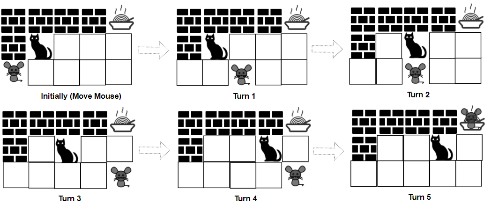
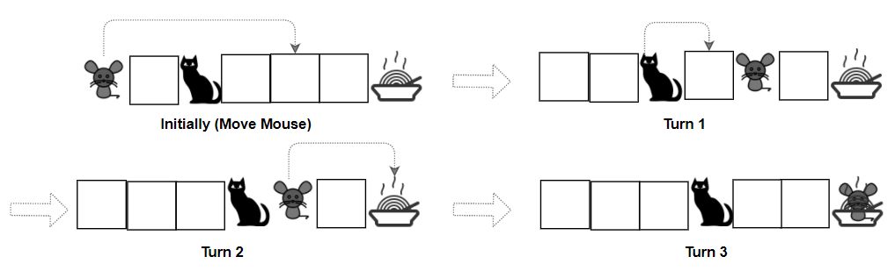

## Problem

A game is played by a cat and a mouse named Cat and Mouse.

The environment is represented by a `grid` of size `rows x cols`, where each element is a wall, floor, player (Cat, Mouse), or food.

- Players are represented by the characters `'C'`(Cat)`,'M'`(Mouse).
- Floors are represented by the character `'.'` and can be walked on.
- Walls are represented by the character `'#'` and cannot be walked on.
- Food is represented by the character `'F'` and can be walked on.
- There is only one of each character `'C'`, `'M'`, and `'F'` in `grid`.

Mouse and Cat play according to the following rules:

- Mouse **moves first**, then they take turns to move.
- During each turn, Cat and Mouse can jump in one of the four directions (left, right, up, down). They cannot jump over the wall nor outside of the `grid`.
- `catJump, mouseJump` are the maximum lengths Cat and Mouse can jump at a time, respectively. Cat and Mouse can jump less than the maximum length.
- Staying in the same position is allowed.
- Mouse can jump over Cat.

The game can end in 4 ways:

- If Cat occupies the same position as Mouse, Cat wins.
- If Cat reaches the food first, Cat wins.
- If Mouse reaches the food first, Mouse wins.
- If Mouse cannot get to the food within 1000 turns, Cat wins.

Given a `rows x cols` matrix `grid` and two integers `catJump` and `mouseJump`, return `true` _if Mouse can win the game if both Cat and Mouse play optimally, otherwise return_ `false`.

<https://leetcode.cn/problems/cat-and-mouse-ii/>

**Example 1:**

{.invert-when-dark}

> Input: `grid = ["####F","#C...","M...."], catJump = 1, mouseJump = 2`
> Output: `true`
> Explanation: Cat cannot catch Mouse on its turn nor can it get the food before Mouse.

**Example 2:**

{.invert-when-dark}

> Input: `grid = ["M.C...F"], catJump = 1, mouseJump = 4`
> Output: `true`

**Example 3:**

> Input: `grid = ["M.C...F"], catJump = 1, mouseJump = 3`
> Output: `false`

**Constraints:**

- `rows == grid.length`
- `cols = grid[i].length`
- `1 <= rows, cols <= 8`
- `grid[i][j]` consist only of characters `'C'`, `'M'`, `'F'`, `'.'`, and `'#'`.
- There is only one of each character `'C'`, `'M'`, and `'F'` in `grid`.
- `1 <= catJump, mouseJump <= 8`

## Test Cases

``` python
class Solution:
    def canMouseWin(self, grid: List[str], catJump: int, mouseJump: int) -> bool:
```



## Thoughts

[913. Cat and Mouse](../913-cat-and-mouse/index.md) 的进阶版，除了地图和输赢的规则更复杂，还增加了老鼠的步数限制。

整体处理方案完全一致，即先找出所有确定输赢的状态，然后从每个状态倒推其上游状态，直到待处理的状态队列清空。最终看初始状态是否得到了确定的结果。

直接套用 [913. Cat and Mouse](../913-cat-and-mouse/index.md) 的代码，根据本题的具体规则做微调即可。

同样用三元组表示游戏的任何一个状态：`state = (mouse, cat, moving)` 分别是老鼠所在位置、猫所在位置、当前该谁移动。本题中的位置也是二元组如 `(r, c)` 表示玩家所在的行和列。

设食物所在的位置为 f0，那么对于任意（不是墙或食物的）位置 `(r, c)`，`(f0, (r, c), CAT)` 表示老鼠吃到食物即老鼠赢，`((r, c), f0, MOUSE)` 表示猫吃到食物即猫赢，`((r, c), (r, c), *)` 表示猫抓到老鼠即猫赢。

设初始时老鼠和猫的位置分别为 m0 和 c0，那么初始状态为 `initial = (m0, c0, MOUSE)`。

`prev_states` 方法用来枚举指定状态的所有上游状态，为了减少计算量，本题没再用 generator，而是直接返回上游状态数组并加了缓存避免重复计算。`move_cnt` 方法返回指定状态的所有下游状态的总数。注意本题允许玩家停在原地不动。

另外题目条件中限制如果老鼠在 1000 步内吃不到食物就算猫赢，不过按照给定的棋盘规模，这种情况很难发生，测试用例中也没有，因此并未实现。如果需要实现，可以在记录每个状态的（最终）输赢结果的同时，记录该状态到实际结果状态的最小步数。

## Code


