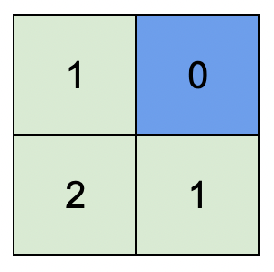
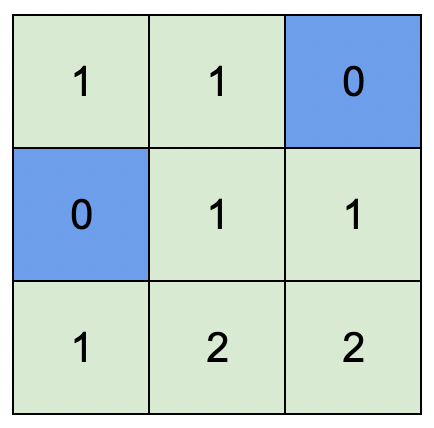

## Problem

You are given an integer matrix `isWater` of size `m x n` that represents a map of **land** and **water** cells.

- If `isWater[i][j] == 0`, cell `(i, j)` is a **land** cell.
- If `isWater[i][j] == 1`, cell `(i, j)` is a **water** cell.

You must assign each cell a height in a way that follows these rules:

- The height of each cell must be non-negative.
- If the cell is a **water** cell, its height must be `0`.
- Any two adjacent cells must have an absolute height difference of **at most** `1`. A cell is adjacent to another cell if the former is directly north, east, south, or west of the latter (i.e., their sides are touching).

Find an assignment of heights such that the maximum height in the matrix is **maximized**.

Return _an integer matrix_ `height` _of size_ `m x n` _where_ `height[i][j]` _is cell_ `(i, j)`_'s height. If there are multiple solutions, return **any** of them_.

<https://leetcode.com/problems/map-of-highest-peak/>

**Example 1:**

{.invert-when-dark}

> Input: `isWater = [[0,1],[0,0]]`
> Output: `[[1,0],[2,1]]`
> Explanation: The image shows the assigned heights of each cell.
> The blue cell is the water cell, and the green cells are the land cells.

**Example 2:**

{.invert-when-dark}

> Input: `isWater = [[0,0,1],[1,0,0],[0,0,0]]`
> Output: `[[1,1,0],[0,1,1],[1,2,2]]`
> Explanation: A height of 2 is the maximum possible height of any assignment.
> Any height assignment that has a maximum height of 2 while still meeting the rules will also be accepted.

**Constraints:**

- `m == isWater.length`
- `n == isWater[i].length`
- `1 <= m, n <= 1000`
- `isWater[i][j]` is `0` or `1`.
- There is at least **one** water cell.

**Note:** This question is the same as 542: <https://leetcode.com/problems/01-matrix/>

## Test Cases

``` python
class Solution:
    def highestPeak(self, isWater: List[List[int]]) -> List[List[int]]:
```



## Thoughts

题目最后的备注太给力了，本题跟 [542. 01 Matrix](../542-01-matrix/index.md) 一模一样。把 `isWater` 的所有 `0` 和 `1` 全部翻转，得到反过来的 `isLand` 矩阵，作为 [542. 01 Matrix](../542-01-matrix/index.md) 的输入，输出就是本题的结果。

本题中对于 height 的要求，可以解读成：

- 距离当前格子最近的「水」的距离。

当然并不用真的把 `isWater` 中所有的零一都翻转，只要翻转 [problem 542](../542-01-matrix/index.md) 代码的判定逻辑即可。

时间复杂度 `O(m * n)`，附加的空间复杂度 `O(1)`。

## Code


