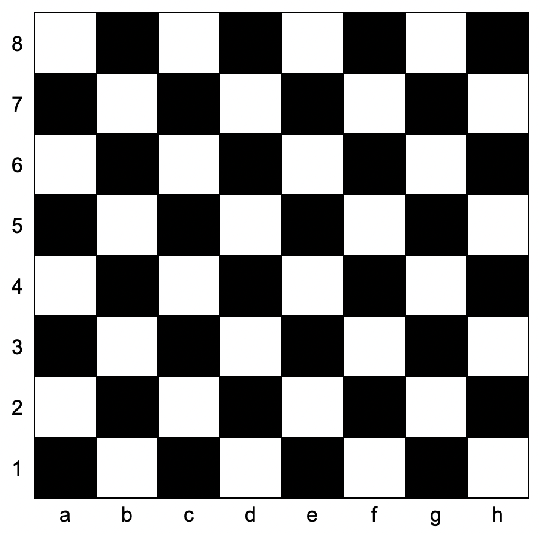

## Problem

You are given `coordinates`, a string that represents the coordinates of a square of the chessboard. Below is a chessboard for your reference.



Return `true` _if the square is white, and_ `false` _if the square is black_.

The coordinate will always represent a valid chessboard square. The coordinate will always have the letter first, and the number second.

<https://leetcode.cn/problems/determine-color-of-a-chessboard-square/>

**Example 1:**

> Input: `coordinates = "a1"`
> Output: `false`
> Explanation: From the chessboard above, the square with coordinates `"a1"` is black, so return `false`.

**Example 2:**

> Input: `coordinates = "h3"`
> Output: `true`
> Explanation: From the chessboard above, the square with coordinates `"h3"` is white, so return `true`.

**Example 3:**

> Input: `coordinates = "c7"`
> Output: `false`

**Constraints:**

- `coordinates.length == 2`
- `'a' <= coordinates[0] <= 'h'`
- `'1' <= coordinates[1] <= '8'`

## Test Cases

``` python
class Solution:
    def squareIsWhite(self, coordinates: str) -> bool:
```



## Thoughts

相当于 [3274. Check if Two Chessboard Squares Have the Same Color](3274-check-if-two-chessboard-squares-have-the-same-color) 的一半。

## Code


