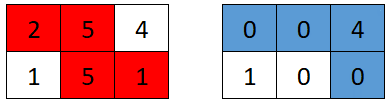
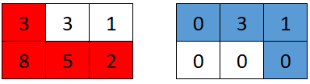
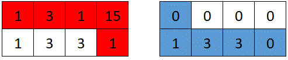

## Problem

You are given a **0-indexed** 2D array `grid` of size `2 x n`, where `grid[r][c]` represents the number of points at position `(r, c)` on the matrix. Two robots are playing a game on this matrix.

Both robots initially start at `(0, 0)` and want to reach `(1, n-1)`. Each robot may only move to the **right** (`(r, c)` to `(r, c + 1)`) or **down** (`(r, c)` to `(r + 1, c)`).

At the start of the game, the **first** robot moves from `(0, 0)` to `(1, n-1)`, collecting all the points from the cells on its path. For all cells `(r, c)` traversed on the path, `grid[r][c]` is set to `0`. Then, the **second** robot moves from `(0, 0)` to `(1, n-1)`, collecting the points on its path. Note that their paths may intersect with one another.

The **first** robot wants to **minimize** the number of points collected by the **second** robot. In contrast, the **second** robot wants to **maximize** the number of points it collects. If both robots play **optimally**, return _the **number of points** collected by the **second** robot._

<https://leetcode.com/problems/grid-game/>

**Example 1:**





> Input: `grid = [[2,5,4],[1,5,1]]`
> Output: `4`
> Explanation: The optimal path taken by the first robot is shown in red, and the optimal path taken by the second robot is shown in blue.
> The cells visited by the first robot are set to 0.
> The second robot will collect `0 + 0 + 4 + 0 = 4` points.

**Example 2:**





> Input: `grid = [[3,3,1],[8,5,2]]`
> Output: `4`
> Explanation: The optimal path taken by the first robot is shown in red, and the optimal path taken by the second robot is shown in blue.
> The cells visited by the first robot are set to 0.
> The second robot will collect `0 + 3 + 1 + 0 = 4` points.

**Example 3:**





> Input: `grid = [[1,3,1,15],[1,3,3,1]]`
> Output: `7`
> Explanation: The optimal path taken by the first robot is shown in red, and the optimal path taken by the second robot is shown in blue.
> The cells visited by the first robot are set to 0.
> The second robot will collect `0 + 1 + 3 + 3 + 0 = 7` points.

**Constraints:**

- `grid.length == 2`
- `n == grid[r].length`
- `1 <= n <= 5 * 10⁴`
- `1 <= grid[r][c] <= 10⁵`

## Test Cases

``` python
class Solution:
    def gridGame(self, grid: List[List[int]]) -> int:
```



## Thoughts

开始以为相当于计算两次带权重的 [62. Unique Paths](../62-unique-paths/index.md)，让 Robot I 先走总分最高的路径，然后把路径上每个格子的 point 改为 0，再让 Robot II 走。

但这样是错误的，Robot I 的目的是让 Robot II 的总分最低，而不是自身的总分最高。

一直在想为什么这道题要限定 grid 的行数为 2，原来这样在 Robot I 走完之后，Robot II 能得到的分数上限就很直观了。设 Robot I 在位置 i（`0 ≤ i < n`）处向下移动，由于 grid 只有两行，那么 Robot I 走完之后，只有第一行的区间 `(i, n)` 和第二行的区间 `[0, i)` 仍有非零 point，而 Robot II 的最优策略是要么拿走第一行所有剩余的 points，要么拿走第二行所有剩余的 points，其能得到的分数最高为 `points(i) = max{Σgrid[0][i+1:], Σgrid[1][:i]}`。遍历所有的 n，记录最小的 `points(i)` 即为 Robot II 能得到的最大分数。

可以先遍历一遍第一行，计算出总和，然后从 `i = 0` 开始，逐步递减第一行的剩余总和（后缀和），递增第二行的剩余总和（前缀和），两行分别的结果取较大者即为 Robot II 能得到的分数。对所有的 i，记录此分数的最小值即可。

时间复杂度 `O(n)`，空间复杂度 `O(1)。

## Code


