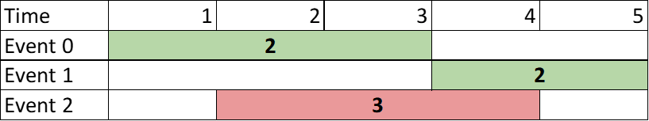
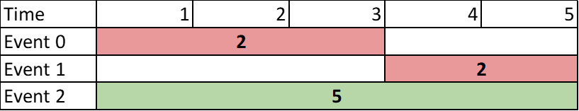
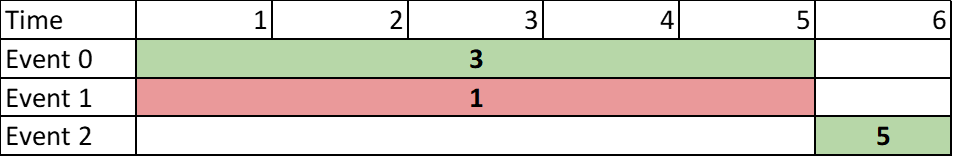

## Problem

You are given a **0-indexed** 2D integer array of `events` where `events[i] = [startTimeᵢ, endTimeᵢ, valueᵢ]`. The `iᵗʰ` event starts at `startTimeᵢ` and ends at `endTimeᵢ`, and if you attend this event, you will receive a value of `valueᵢ`. You can choose **at most** **two** **non-overlapping** events to attend such that the sum of their values is **maximized**.

Return _this **maximum** sum._

Note that the start time and end time is **inclusive**: that is, you cannot attend two events where one of them starts and the other ends at the same time. More specifically, if you attend an event with end time `t`, the next event must start at or after `t + 1`.

<https://leetcode.com/problems/two-best-non-overlapping-events/>

**Example 1:**

{.invert-when-dark}

> Input: `events = [[1,3,2],[4,5,2],[2,4,3]]`
> Output: `4`
> Explanation: Choose the green events, 0 and 1 for a sum of `2 + 2 = 4`.

**Example 2:**

{.invert-when-dark}

> Input: `events = [[1,3,2],[4,5,2],[1,5,5]]`
> Output: `5`
> Explanation: Choose event 2 for a sum of `5`.

**Example 3:**

{.invert-when-dark}

> Input: `events = [[1,5,3],[1,5,1],[6,6,5]]`
> Output: `8`
> Explanation: Choose events 0 and 2 for a sum of `3 + 5 = 8`.

**Constraints:**

- `2 <= events.length <= 10⁵`
- `events[i].length == 3`
- `1 <= startTimeᵢ <= endTimeᵢ <= 10⁹`
- `1 <= valueᵢ <= 10⁶`

## Test Cases

```python
class Solution:
    def maxTwoEvents(self, events: List[List[int]]) -> int:
```



## Thoughts

先按 `startTime` 排序所有 events，逆序遍历一遍可以计算出在每个 `startTime` 及之后，选一个 event 的最大 value。

再按 `endTime` 排序，正序遍历一遍计算出在每个 `endTime` 及之前，选一个 event 的最大 value。

那么对于任意时刻 t，都可以计算出在 t 之前（不含 t）能得到的最大 value，以及在 t 之后（含 t）能得到的最大 value，二者相加就是 t 时刻对应的总的最大 value。

只需要遍历所有 events 的 `startTime` 和 `endTime`。因为都已经排序了，对于遍历过程中的每个时刻，可以用常数时间计算其对应的最大 value。

总的时间复杂度 `O(n log n)`（主要是排序），空间复杂度 `O(n)`。

## Code



不是很快，才 `34+%`，回头再优化。
