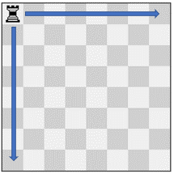
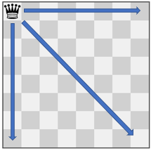
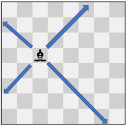
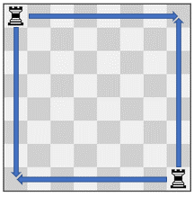
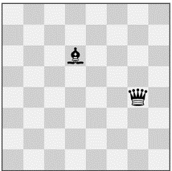

## Problem

There is an `8 x 8` chessboard containing `n` pieces (rooks, queens, or bishops). You are given a string array `pieces` of length `n`, where `pieces[i]` describes the type (rook, queen, or bishop) of the `iᵗʰ` piece. In addition, you are given a 2D integer array `positions` also of length `n`, where `positions[i] = [rᵢ, cᵢ]` indicates that the `iᵗʰ` piece is currently at the **1-based** coordinate `(rᵢ, cᵢ)` on the chessboard.

When making a **move** for a piece, you choose a **destination** square that the piece will travel toward and stop on.

- A rook can only travel **horizontally or vertically** from `(r, c)` to the direction of `(r+1, c)`, `(r-1, c)`, `(r, c+1)`, or `(r, c-1)`.
- A queen can only travel **horizontally, vertically, or diagonally** from `(r, c)` to the direction of `(r+1, c)`, `(r-1, c)`, `(r, c+1)`, `(r, c-1)`, `(r+1, c+1)`, `(r+1, c-1)`, `(r-1, c+1)`, `(r-1, c-1)`.
- A bishop can only travel **diagonally** from `(r, c)` to the direction of `(r+1, c+1)`, `(r+1, c-1)`, `(r-1, c+1)`, `(r-1, c-1)`.

You must make a **move** for every piece on the board simultaneously. A **move combination** consists of all the **moves** performed on all the given pieces. Every second, each piece will instantaneously travel **one square** towards their destination if they are not already at it. All pieces start traveling at the `0ᵗʰ` second. A move combination is **invalid** if, at a given time, **two or more** pieces occupy the same square.

Return _the number of **valid** move combinations_.

**Notes:**

- **No two pieces** will start in the **same** square.
- You may choose the square a piece is already on as its **destination**.
- If two pieces are **directly adjacent** to each other, it is valid for them to **move past each other** and swap positions in one second.

有一个 `8 x 8` 的棋盘，它包含 `n` 个棋子（棋子包括车，后和象三种）。给你一个长度为 `n` 的字符串数组 `pieces` ，其中 `pieces[i]` 表示第 `i` 个棋子的类型（车，后或象）。除此以外，还给你一个长度为 `n` 的二维整数数组 `positions` ，其中 `positions[i] = [rᵢ, cᵢ]` 表示第 `i` 个棋子现在在棋盘上的位置为 `(rᵢ, cᵢ)` ，棋盘下标从 **1** 开始。

棋盘上每个棋子都可以移动 **至多一次** 。每个棋子的移动中，首先选择移动的 **方向** ，然后选择 **移动的步数** ，同时你要确保移动过程中棋子不能移到棋盘以外的地方。棋子需按照以下规则移动：

- 车可以 **水平或者竖直** 从 `(r, c)` 沿着方向 `(r+1, c)`，`(r-1, c)`，`(r, c+1)` 或者 `(r, c-1)` 移动。
- 后可以 **水平竖直或者斜对角** 从 `(r, c)` 沿着方向 `(r+1, c)`，`(r-1, c)`，`(r, c+1)`，`(r, c-1)`，`(r+1, c+1)`，`(r+1, c-1)`，`(r-1, c+1)`，`(r-1, c-1)` 移动。
- 象可以 **斜对角** 从 `(r, c)` 沿着方向 `(r+1, c+1)`，`(r+1, c-1)`，`(r-1, c+1)`，`(r-1, c-1)` 移动。

**移动组合** 包含所有棋子的 **移动** 。每一秒，每个棋子都沿着它们选择的方向往前移动 **一步** ，直到它们到达目标位置。所有棋子从时刻 `0` 开始移动。如果在某个时刻，两个或者更多棋子占据了同一个格子，那么这个移动组合 **不有效** 。

请你返回 **有效** 移动组合的数目。

**注意：**

- 初始时，**不会有两个棋子** 在 **同一个位置 。**
- 有可能在一个移动组合中，有棋子不移动。
- 如果两个棋子 **直接相邻** 且两个棋子下一秒要互相占据对方的位置，可以将它们在同一秒内 **交换位置** 。

<https://leetcode.cn/problems/number-of-valid-move-combinations-on-chessboard/>

**Example 1:**





> Input: `pieces = ["rook"], positions = [[1,1]]`
> Output: `15`
> Explanation: The image above shows the possible squares the piece can move to.

**Example 2:**





> Input: `pieces = ["queen"], positions = [[1,1]]`
> Output: `22`
> Explanation: The image above shows the possible squares the piece can move to.

**Example 3:**





> Input: `pieces = ["bishop"], positions = [[4,3]]`
> Output: `12`
> Explanation: The image above shows the possible squares the piece can move to.

**Example 4:**





> `输入：pieces = ["rook","rook"], positions = [[1,1],[8,8]]`
> `输出：223`
> 解释：每个车有 15 种移动，所以总共有 `15 * 15 = 225` 种移动组合。
> 但是，有两个是不有效的移动组合：
>
> - 将两个车都移动到 `(8, 1)` ，会导致它们在同一个格子相遇。
> - 将两个车都移动到 `(1, 8)` ，会导致它们在同一个格子相遇。
> 所以，总共有 `225 - 2 = 223` 种有效移动组合。
> 注意，有两种有效的移动组合，分别是一个车在 `(1, 8)` ，另一个车在 `(8, 1)` 。
> 即使棋盘状态是相同的，这两个移动组合被视为不同的，因为每个棋子移动操作是不相同的。

**Example 5:**





> `输入：pieces = ["queen","bishop"], positions = [[5,7],[3,4]]`
> `输出：281`
> 解释：总共有 `12 * 24 = 288` 种移动组合。
> 但是，有一些不有效的移动组合：
>
> - 如果后停在 `(6, 7)` ，它会阻挡象到达 `(6, 7)` 或者 `(7, 8)` 。
> - 如果后停在 `(5, 6)` ，它会阻挡象到达 `(5, 6)` ，`(6, 7)` 或者 `(7, 8)` 。
> - 如果象停在 `(5, 2)` ，它会阻挡后到达 `(5, 2)` 或者 `(5, 1)` 。
> 在 288 个移动组合当中，281 个是有效的。

**Constraints:**

- `n == pieces.length`
- `n == positions.length`
- `1 <= n <= 4`
- `pieces` only contains the strings `"rook"`, `"queen"`, and `"bishop"`.
- There will be at most one queen on the chessboard.
- `1 <= rᵢ, cᵢ <= 8`
- Each `positions[i]` is distinct.

## Test Cases

``` python
class Solution:
    def countCombinations(self, pieces: List[str], positions: List[List[int]]) -> int:
```



## Thoughts

一个可行的移动组合，或者叫移动方案，是在开始的时候就确定好每个棋子要往哪个方向移动以及在哪里停下（也可以留在初始位置不动），都确定好了之后，所有棋子同时开始移动，每秒走一步（一格）。在任何时刻，不能有两个或以上棋子在同一格。

对于车，不管初始在什么位置，总共有 `8 + 8 - 1 = 15` 个可能的目标位置，即 15 个方案。

对于象，初始位置 `(r, c)`，根据 [51. N-Queens](51-n-queens) 中对斜线是否占用的判定可知，它能到达的位置 `(r', c')` 一定满足 `r + c = r' + c'` 或 `r - c = r' - c'`。由此可以计算出可能的目标位置总数。

> 正斜线「`／`」（`r + c` 恒等）的可能目标位置数量为 `8 - |r+c-9|`。
> 反斜线「`＼`」（`r - c` 恒等）的可能目标位置数量为 `8 - |r-c|`。
> 总数为 `15 - |r+c-9| - |r-c|`（比如 example 3 中 `(r, c) = (4, 3)`，则总数为 `15 - |4+3-9| - |4-3| = 12`）。

对于后，相当于车和象的可能目标位置的总和减去一（初始位置重复计数了），即 `29 - |r+c-9| - |r-c|`。

如果有两个棋子，各自的目标位置相互独立，乘起来就是移动组合总数，但是需要去掉冲突的组合。更多的棋子数量，要把冲突的数量直接算出来似乎不可行。

考虑回溯法，类似 [52. N-Queens II](52-n-queens-ii) 那样，遍历所有棋子的所有可能目标位置的组合，裁剪掉不可行的组合方案，统计可行方案总数。

先看如何裁剪。如果前 `k - 1` 个棋子的目标位置已知，第 k 个棋子在移动中不被其他棋子阻挡，也不能阻挡其他棋子。当两个棋子的路径有交点时，如果交点到两个棋子初始位置的距离相等则会路上相遇，不是可行组合；或者如果交点是其中一个棋子的终点，且这个棋子到交点的时间更短，则会挡住另一个棋子通过，也不是可行组合。

设棋盘边长为 `m = 8`，每个棋子有大约 `2m` 个可能的目标位置（「后」有大约 `4m` 个）。处理时间为 `T(n) = 2m * O(n) * T(n-1) = O((mn)ⁿ)`（其中 `O(n)` 是因为要跟其他棋子的路径分别做相交判断）。

相交判定的逻辑写起来还挺麻烦的，还要考虑各种分支场景和边界条件。

考虑把前 `k - 1` 个棋子在每一秒所在的位置记录下来，最终停下的位置（和时刻）也记录下来。让第 k 个棋子从初始位置开始往某个方向移动，看第 t 秒它要去的位置，如果有其他棋子也会在第 t 秒经过，或者在第 t 秒之前就停在那里，则不能进入该位置，也就不用再继续往前走了，改去尝试另一个方向。如果有其他棋子会在第 t 秒之后经过，则不能停在该位置，需要继续看下一个位置。如果既不被挡也不挡路，则可以让第 k 个棋子以该位置作为一个可能的目标位置，继续回溯下一个棋子。

考虑到稀疏性，可以用哈希表存储。以位置坐标 `(r, c)` 为 key，值是会有棋子经过该位置的时刻的集合（`O(n)`），以及从第几秒开始有棋子停在此处。最多需要记录 n 个棋子分别在 m 个时刻（因为任何棋子的路径最多是 m 个位置）的信息，所以需要 `O(mn)` 辅助空间。

基于此辅助存储，对于第 k 个棋子，让它沿某个方向一步一步走，每一步用常数时间判断是否被挡住，用 `O(n)` 时间判断如果停下是否后续挡路（检查该位置会有棋子经过的所有时刻，最多 k - 1 个，看有没有超过当前时刻的）。不同的方向数量记为常数。总共时间是 `T(n) = m * O(n) * T(n-1) = O((mn)ⁿ)`。

> 一直不想用这种方式，想看看有没有更直接的计算方式。没想出来。
>
> 不过速度还不太慢，93%。

最终总的时间复杂度 `O((mn)ⁿ)`，空间复杂度 `O(mn)`。

## Code


