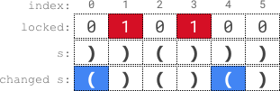

## Problem

A parentheses string is a **non-empty** string consisting only of `'('` and `')'`. It is valid if **any** of the following conditions is **true**:

- It is `()`.
- It can be written as `AB` (`A` concatenated with `B`), where `A` and `B` are valid parentheses strings.
- It can be written as `(A)`, where `A` is a valid parentheses string.

You are given a parentheses string `s` and a string `locked`, both of length `n`. `locked` is a binary string consisting only of `'0'`s and `'1'`s. For **each** index `i` of `locked`,

- If `locked[i]` is `'1'`, you **cannot** change `s[i]`.
- But if `locked[i]` is `'0'`, you **can** change `s[i]` to either `'('` or `')'`.

Return `true` _if you can make `s` a valid parentheses string_. Otherwise, return `false`.

<https://leetcode.com/problems/check-if-a-parentheses-string-can-be-valid/>

**Example 1:**

{.invert-when-dark}

> Input: `s = "))()))", locked = "010100"`
> Output: `true`
> Explanation: `locked[1] == '1'` and `locked[3] == '1'`, so we cannot change `s[1]` or `s[3]`.
> We change `s[0]` and `s[4]` to `'('` while leaving `s[2]` and `s[5]` unchanged to make s valid.

**Example 2:**

> Input: `s = "()()", locked = "0000"`
> Output: `true`
> Explanation: We do not need to make any changes because s is already valid.

**Example 3:**

> Input: `s = ")", locked = "0"`
> Output: `false`
> Explanation: locked permits us to change `s[0]`.
> Changing `s[0]` to either `'('` or `')'` will not make s valid.

**Constraints:**

- `n == s.length == locked.length`
- `1 <= n <= 10⁵`
- `s[i]` is either `'('` or `')'`.
- `locked[i]` is either `'0'` or `'1'`.

## Test Cases

```python
class Solution:
    def canBeValid(self, s: str, locked: str) -> bool:
```



## Thoughts

如果 n 是奇数则肯定不行。

从左向右遍历，看锁定的右括号是不是都能配对。如果一个位置是未锁定的，则可以放左括号也可以放右括号，记住有多少个。如果是锁定的左括号，计数加一。如果是锁定的右括号，则先消耗一个已知的锁定的左括号，如果没有则消耗一个未锁定的位置，如果也没有则无法完成配对。

同理从右向左遍历，看锁定的左括号是不是都能配对。

时间复杂度 `O(n)`，空间复杂度 `O(1)`。

## Code


