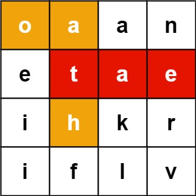
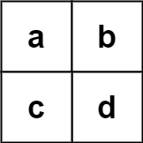

## Problem

Given an `m x n` `board` of characters and a list of strings `words`, return _all words on the board_.

Each word must be constructed from letters of sequentially adjacent cells, where **adjacent cells** are horizontally or vertically neighboring. The same letter cell may not be used more than once in a word.

<https://leetcode.com/problems/word-search-ii/>

**Example 1:**

{.invert-when-dark}

> Input: `board = [["o","a","a","n"],["e","t","a","e"],["i","h","k","r"],["i","f","l","v"]], words = ["oath","pea","eat","rain"]`
> Output: `["eat","oath"]`

**Example 2:**

{.invert-when-dark}

> Input: `board = [["a","b"],["c","d"]], words = ["abcb"]`
> Output: `[]`

**Constraints:**

- `m == board.length`
- `n == board[i].length`
- `1 <= m, n <= 12`
- `board[i][j]` is a lowercase English letter.
- `1 <= words.length <= 3 * 10⁴`
- `1 <= words[i].length <= 10`
- `words[i]` consists of lowercase English letters.
- All the strings of `words` are unique.

## Test Cases

```python
class Solution:
    def findWords(self, board: List[List[str]], words: List[str]) -> List[str]:
```



## Thoughts

[79. Word Search](../79-word-search/index.md) 的进阶版，待搜索的单词从一个增加到若干个。

在遍历 `board` 的时候，比如当前 cell 的字符是 `a`，那要看 `words` 中有没有以 `a` 开头的，如果有才继续再看 `a` 的上下左右。

同理，如果已经拿到了长度为 `k` 的子串，对第 `k` 个 cell，判断是否要继续加入其上下左右的 cell 时，也是看如果加入进来，`words` 中是否有以这 `k + 1` 个字符为前缀的单词。

[208. Implement Trie (Prefix Tree)](../208-implement-trie-prefix-tree/index.md) 里的 trie 树正好适合这个问题。

给这个 `Trie` 类型增加一个 `remove(word: str)` 方法，在搜索到一个单词后把它从 trie 树中删除，以后就不必再对该单词做判定了。

另外在增加和删除单词的时候，记录和更新 trie 树中存储的单词总数，如果所有的词都找到了，就直接结束。

设一共有 W 个单词，单词的平均长度为 w。建立 trie 树的时间复杂度是 `O(W * w)`，空间复杂度也是。在 `board` 查找所有单词的时间复杂度跟只找一个单词是一样的，都是 `O(m * n * 4ʷ)`，空间复杂度 `O(w)`。

## Code


