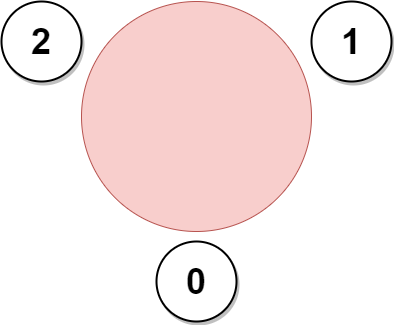
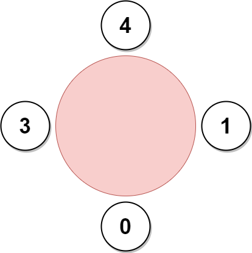

## Problem

A company is organizing a meeting and has a list of `n` employees, waiting to be invited. They have arranged for a large **circular** table, capable of seating **any number** of employees.

The employees are numbered from `0` to `n - 1`. Each employee has a **favorite** person and they will attend the meeting **only if** they can sit next to their favorite person at the table. The favorite person of an employee is **not** themself.

Given a **0-indexed** integer array `favorite`, where `favorite[i]` denotes the favorite person of the `iᵗʰ` employee, return _the **maximum number of employees** that can be invited to the meeting_.

<https://leetcode.com/problems/maximum-employees-to-be-invited-to-a-meeting/>

**Example 1:**





> Input: `favorite = [2,2,1,2]`
> Output: `3`
> Explanation:
> The above figure shows how the company can invite employees 0, 1, and 2, and seat them at the round table.
> All employees cannot be invited because employee 2 cannot sit beside employees 0, 1, and 3, simultaneously.
> Note that the company can also invite employees 1, 2, and 3, and give them their desired seats.
> The maximum number of employees that can be invited to the meeting is 3.

**Example 2:**

> Input: `favorite = [1,2,0]`
> Output: `3`
> Explanation:
> Each employee is the favorite person of at least one other employee, and the only way the company can invite them is if they invite every employee.
> The seating arrangement will be the same as that in the figure given in example 1:
>
> - Employee 0 will sit between employees 2 and 1.
> - Employee 1 will sit between employees 0 and 2.
> - Employee 2 will sit between employees 1 and 0.
>
> The maximum number of employees that can be invited to the meeting is 3.

**Example 3:**





> Input: `favorite = [3,0,1,4,1]`
> Output: `4`
> Explanation:
> The above figure shows how the company will invite employees 0, 1, 3, and 4, and seat them at the round table.
> Employee 2 cannot be invited because the two spots next to their favorite employee 1 are taken.
> So the company leaves them out of the meeting.
> The maximum number of employees that can be invited to the meeting is 4.

**Constraints:**

- `n == favorite.length`
- `2 <= n <= 10⁵`
- `0 <= favorite[i] <= n - 1`
- `favorite[i] != i`

## Test Cases

``` python
class Solution:
    def maximumInvitations(self, favorite: List[int]) -> int:
```



## Thoughts

以每个人为顶点作图，如果 u 的最爱是 v，则作有向边 `(u, v)`。显然每个顶点的出度均为 1，入度为其粉丝的数量。

因为所有顶点的出度均为 1，最终的图一定会形成一个或多个连通的子图，每个子图中有且只有一个环（环的每个顶点上都可以挂一棵反向的「树」，是由该顶点的粉丝以及粉丝的粉丝……组成的）。

先利用 [684. Redundant Connection](684-redundant-connection) 中的并查集（disjoint-set）找出所有的子图，以及每个子图中环上的一条边。显然当对某条边执行并查集的 `union` 操作时，如果返回 `false`，此边就是某个子图环路上的一条边，且每个子图只会找出来一条边（环路上最后见到的那条边）。

对于一条环路上的边，遍历一遍，就可以求出环的长度。

看如何安排这些人的座位。

如果环的长度超过 2，那么只能是让环上的所有人围成一圈，其他任何人都无法插入进去。





但如果环的长度为 2（即两个人双向奔赴），他俩的两边都可以挂一串粉丝链路。而且如果有多个这样的 couple + 粉丝组合，全都可以围成一圈，仍然满足所有人都跟自己的最爱挨着坐。





所以对于每一个环长度为 2 的子图，需要找出分别以两个顶点为终点的最长的路径（acyclic chain），可以用深度优先遍历处理。

最终所有环长度为 2 的子图的可上桌人数之和，与最大的环长度，二者取较大的为题目结果。

整体时间复杂度 `O(n)`，空间复杂度 `O(n)`。

## Code



提交跑下来比较慢，可能系数太大了。而且显然第一步做的并查集并没有太大帮助，计算量基本都浪费了，可以考虑优化。

## Faster

可以用拓扑排序。

先计算出每个顶点的入度（此人的粉丝数量），将入度为 0 的顶点放在队列中。每次从队列弹出一个入度为 0 的顶点，将其指向的顶点的入度减一。如果后者的入度降为 0，则加入队列。当队列清空的时候，剩下的就是若干个环。

另外在这个过程中，很容易跟踪记录，对于环上的每个顶点，指向它的无环边的最大长度。记 `d(u)` 表示指向顶点 u 的无环边的最大长度，那么当见到一条边 `(u, v)`，有 `d(v) = max{d(v), d(u) + 1}`。`d(u)` 的初始值为 0。

对于剩下的那些环，任取环上的一个顶点，沿着环路走一圈即可求出环长。

如果顶点 u 和 v 构成一个长度为 2 的环（`favorite[u] = v, favorite[v] = u`），那么 `2 + d(u) + d(v)` 就是这一对 couple 及其粉丝们可以上桌的最大数量。

时间复杂度和空间复杂度还是 `O(n)`。


