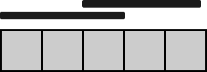

## Problem

You are given a **0-indexed binary** string `floor`, which represents the colors of tiles on a floor:

- `floor[i] = '0'` denotes that the `iᵗʰ` tile of the floor is colored **black**.
- On the other hand, `floor[i] = '1'` denotes that the `iᵗʰ` tile of the floor is colored **white**.

You are also given `numCarpets` and `carpetLen`. You have `numCarpets` **black** carpets, each of length `carpetLen` tiles. Cover the tiles with the given carpets such that the number of **white** tiles still visible is **minimum**. Carpets may overlap one another.

Return _the **minimum** number of white tiles still visible._

<https://leetcode.cn/problems/minimum-white-tiles-after-covering-with-carpets/>

**Example 1:**


> Input: `floor = "10110101", numCarpets = 2, carpetLen = 2`
> Output: `2`
> Explanation:
> The figure above shows one way of covering the tiles with the carpets such that only 2 white tiles are visible.
> No other way of covering the tiles with the carpets can leave less than 2 white tiles visible.

**Example 2:**



> Input: `floor = "11111", numCarpets = 2, carpetLen = 3`
> Output: `0`
> Explanation:
> The figure above shows one way of covering the tiles with the carpets such that no white tiles are visible.
> Note that the carpets are able to overlap one another.

**Constraints:**

- `1 <= carpetLen <= floor.length <= 1000`
- `floor[i]` is either `'0'` or `'1'`.
- `1 <= numCarpets <= 1000`

## Test Cases

```python
class Solution:
    def minimumWhiteTiles(self, floor: str, numCarpets: int, carpetLen: int) -> int:
```



## Thoughts

定义 `dp(i, j)` 表示用 j 块地毯覆盖地板的区间 `[0, i]`，无法被覆盖的白色砖块的最少数量。显然题目所求即为 `dp(n-1, m)`（n 表示砖块的数量，m 表示地毯的数量）。

可以先对 floor 字符串做个预处理，定义 `floors[i]` 为 `1`（数字）表示白砖，`0` 表示黑砖：

$$
floors[i]=\begin{cases}
  1 & \text{if }floor[i]=`1\text{\textquoteright} \\
  0 & \text{otherwise}
\end{cases}
$$

对于 `dp(i, j)`，一个选择是不覆盖砖块 i，那么未覆盖的白砖数量为 `dp(i - 1, j) + floors[i]`；另一个选择是用一块地毯沿着砖块 i 的右侧边铺放，它能覆盖区间 `(i - l, i]`（其中 `l = carpetLen`）的砖块，然后用剩余的 `j - 1` 块地毯覆盖区间 `[0, i - l]` 的砖块，总共覆盖不到的白砖数量为 `dp(i - l, j - 1)`。这两个选择下取较小的，即为 `dp(i, j)` 的值。

为了便于处理边界值，可以定义 `dp(i, -1) = ∞`，这样可以用同一个式子表达 `dp(i, 0)` 的计算逻辑。

一个平凡的情况是当 `i < j * l` 时，显然 `dp(i, j) = 0`。

所以 `dp(i, j)` 的状态转移公式为：

$$
dp(i,j)=\begin{cases}
  \infty & \text{if }j<0 \\
  0 & \text{if }i<j*l \\
  \min\begin{cases}
    dp(i-1,j)+floors[i] \\
    dp(i-l,j-1)
  \end{cases}
\end{cases}
$$

从 0 到 m 递增 j，对于每个 j，从 `j * l` 开始递增到 `n - 1` 计算 dp 值。只需要保留 `j - 1` 和 j 的两组 dp 值。

时间复杂度 `O(m * n)`，空间复杂度 `O(n)`。

## Code


