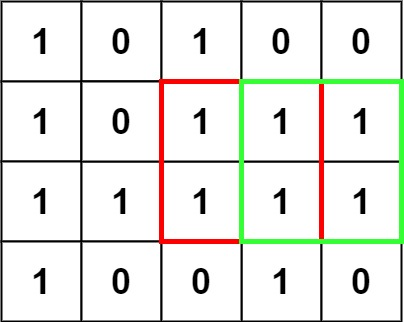
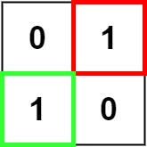

## Problem

Given an `m x n` binary `matrix` filled with `0`'s and `1`'s, _find the largest square containing only_ `1`'s _and return its area_.

<https://leetcode.com/problems/maximal-square/>

**Example 1:**

{.invert-when-dark}

> Input: `matrix = [["1","0","1","0","0"],["1","0","1","1","1"],["1","1","1","1","1"],["1","0","0","1","0"]]`
> Output: `4`

**Example 2:**

{.invert-when-dark}

> Input: `matrix = [["0","1"],["1","0"]]`
> Output: `1`

**Example 3:**

> Input: `matrix = [["0"]]`
> Output: `0`

**Constraints:**

- `m == matrix.length`
- `n == matrix[i].length`
- `1 <= m, n <= 300`
- `matrix[i][j]` is `'0'` or `'1'`.

## Test Cases

```python
class Solution:
    def maximalSquare(self, matrix: List[List[str]]) -> int:
```



## Thoughts

对于任意格子 `(i, j)`（`0 ≤ i < m`、`0 ≤ j < n`），定义三个状态量：

- `h(i, j)` 表示以格子 `(i, j)` 为最右端的连续 `'1'` 的个数。
- `v(i, j)` 表示以格子 `(i, j)` 为最下端的连续 `'1'` 的个数。
- `s(i, j)` 表示以格子 `(i, j)` 为右下角的全 `'1'` 正方形的边长。

可得状态转移方程：

当 `matrix[i][j] = '0'` 时：

$$
\begin{cases}
  h(i,j)=0 \\
  v(i,j)=0 \\
  s(i,j)=0
\end{cases}
$$

当 `matrix[i][j] = '1'` 时：

$$
\begin{cases}
  h(i,j)=h(i,j-1)+1 \\
  v(i,j)=v(i-1,j)+1 \\
  s(i,j)=\min\begin{cases}
    s(i-1,j-1)+1 \\
    h(i,j) \\
    v(i,j)
  \end{cases}
\end{cases}
$$

边界值 `h(i, -1) = v(-1, j) = s(-1, -1) = s(i, -1) = s(-1, j) = 0`。递推过程中记录最大的 s 值，取平方则为题目所求结果。

根据状态转移方程的依赖关系，在递推过程中只需要保留一行的 v 和 s 值，只需要保留当前行的一个 h 值。

整体时间复杂度 `O(m * n)`，空间复杂度 `O(n)`。

## Code


