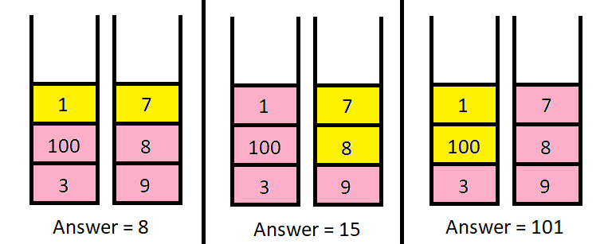

## Problem

There are `n` **piles** of coins on a table. Each pile consists of a **positive number** of coins of assorted denominations.

In one move, you can choose any coin on **top** of any pile, remove it, and add it to your wallet.

Given a list `piles`, where `piles[i]` is a list of integers denoting the composition of the `iᵗʰ` pile from **top to bottom**, and a positive integer `k`, return _the **maximum total value** of coins you can have in your wallet if you choose **exactly**_ `k` _coins optimally_.

<https://leetcode.cn/problems/maximum-value-of-k-coins-from-piles/>

**Example 1:**

{.invert-when-dark}

> Input: `piles = [[1,100,3],[7,8,9]], k = 2`
> Output: `101`
> Explanation:
> The above diagram shows the different ways we can choose k coins.
> The maximum total we can obtain is 101.

**Example 2:**

> Input: `piles = [[100],[100],[100],[100],[100],[100],[1,1,1,1,1,1,700]], k = 7`
> Output: `706`
> Explanation:
> The maximum total can be obtained if we choose all coins from the last pile.

**Constraints:**

- `n == piles.length`
- `1 <= n <= 1000`
- `1 <= piles[i][j] <= 10⁵`
- `1 <= k <= sum(piles[i].length) <= 2000`

## Test Cases

``` python
class Solution:
    def maxValueOfCoins(self, piles: List[List[int]], k: int) -> int:
```



## Thoughts

记 `dp(p, j)` 表示从 `piles[0...p]` 中选取刚好 j 枚硬币（`0 ≤ p < n`，`1 ≤ j ≤ k`），可以得到的最大总额。

先不考虑边界情况（即假设每个 pile 都有足够多的硬币），显然有：

$$
dp(p,j)=\max_{0\le i\le j}{\left\{dp(p-1,j-i)+\sum{piles[p][:i]}\right\}}
$$

初值 `dp(-1, j) = 0`，`dp(p, 0) = 0`。最终结果为 `dp(n-1, k)`。

即从 `piles[p]` 取 i 枚硬币（`0 ≤ i ≤ j`），剩余的 `j - i` 枚从 `piles[0...p-1]` 取。

一个明显的优化是计算从 `piles[p]` 取 i 枚硬币的总额，并不需要对于所有的 i 都从 0 开始累加，只需要先计算一遍前缀和，然后直接利用 `piles[p]` 的空间存储前缀和。即更新后的 `piles'[p][i] = Σpiles[p][0...i]`，可得：

$$
dp(p,j)=\max\begin{cases}
  dp(p-1,j) \\
  \max_{0\le i<j}{\left\{dp(p-1,j-i-1)+piles'[p][i]\right\}}
\end{cases}
$$

计算 `dp(p, j)` 时只用到 `dp(p-1, *)`，可以只保留最新的 p 对应的 dp 值。

时间复杂度 `O(n * k²)`，空间复杂度 `O(k)`。

考虑到边界条件，可以有一些小优化。比如 `piles[0...p]` 包含的硬币总数比 k 小，则只需要计算到硬币总数，不需要计算到 k。如果 `piles[p]` 的硬币数大于 k，则只需要计算前 k 项的前缀和。对于任意 j，如果 `piles[p]` 的硬币数小于 j，则 $max_{0\le i\le j}$ 这一项的上限可以只取到硬币数。

## Code


