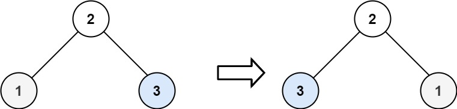

## Problem

Given the `root` of a binary tree, invert the tree, and return _its root_.

<https://leetcode.com/problems/invert-binary-tree/>

**Example 1:**





> Input: `root = [4,2,7,1,3,6,9]`
> Output: `[4,7,2,9,6,3,1]`

**Example 2:**





> Input: `root = [4,2,7,1,3,6,9]`
> Output: `[4,7,2,9,6,3,1]`

**Example 3:**

> Input: `root = []`
> Output: `[]`

**Constraints:**

- The number of nodes in the tree is in the range `[0, 100]`.
- `-100 <= Node.val <= 100`

## Test Cases

``` python
# Definition for a binary tree node.
# class TreeNode:
#     def __init__(self, val=0, left=None, right=None):
#         self.val = val
#         self.left = left
#         self.right = right
class Solution:
    def invertTree(self, root: Optional[TreeNode]) -> Optional[TreeNode]:
```



## Thoughts

按任何顺序遍历二叉树，前序（pre-order，NLR），对于当前节点，交换左右子节点即可。

## Code


