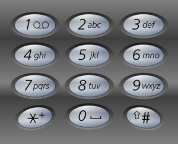

## Problem

Alice is texting Bob using her phone. The **mapping** of digits to letters is shown in the figure below.



In order to **add** a letter, Alice has to **press** the key of the corresponding digit `i` times, where `i` is the position of the letter in the key.

- For example, to add the letter `'s'`, Alice has to press `'7'` four times. Similarly, to add the letter `'k'`, Alice has to press `'5'` twice.
- Note that the digits `'0'` and `'1'` do not map to any letters, so Alice **does not** use them.

However, due to an error in transmission, Bob did not receive Alice's text message but received a **string of pressed keys** instead.

- For example, when Alice sent the message `"bob"`, Bob received the string `"2266622"`.

Given a string `pressedKeys` representing the string received by Bob, return _the **total number of possible text messages** Alice could have sent_.

Since the answer may be very large, return it **modulo** `10⁹ + 7`.

<https://leetcode.cn/problems/count-number-of-texts/>

**Example 1:**

> Input: `pressedKeys = "22233"`
> Output: `8`
> Explanation:
> The possible text messages Alice could have sent are:
> `"aaadd"`, `"abdd"`, `"badd"`, `"cdd"`, `"aaae"`, `"abe"`, `"bae"`, and `"ce"`.
> Since there are 8 possible messages, we return 8.

**Example 2:**

> Input: `pressedKeys = "222222222222222222222222222222222222"`
> Output: `82876089`
> Explanation:
> There are 2082876103 possible text messages Alice could have sent.
> Since we need to return the answer modulo `10⁹ + 7`, we return `2082876103 % (10⁹ + 7) = 82876089`.

**Constraints:**

- `1 <= pressedKeys.length <= 10⁵`
- `pressedKeys` only consists of digits from `'2'` - `'9'`.

## Test Cases

``` python
class Solution:
    def countTexts(self, pressedKeys: str) -> int:
```



## Thoughts

跟 [70. Climbing Stairs](../70-climbing-stairs/index.md) 类似。

可以发现数字 7 和 9 是一组（对应 4 个字母），其他数字是一组（每个数字对应 3 个字母）。

记 `dp4(n)` 表示连续 n 个数字 7（或 9），可能的文本数量，显然有 $dp4(n)=\sum_{i=1}^{4}dp(n-i)$。

同理即 `dp3(n)` 表示连续 n 个其他数字，可能的文本数量，有 $dp3(n)=\sum_{i=1}^{3}dp(n-i)$。

遍历 `pressedKeys`，对于每一组连续相同的字符，根据 dp3 或者 dp4 计算出这一组字符可能的文本数量。不同的组之间彼此独立，可能数相乘即为总的可能数。

时间复杂度 `O(n)`，空间复杂度 `O(n)`。

## Code


