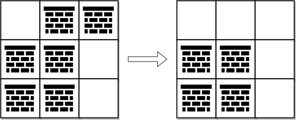
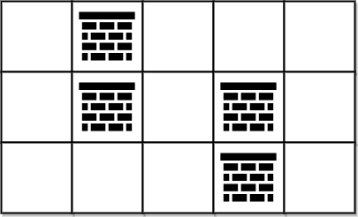

## Problem

You are given a **0-indexed** 2D integer array `grid` of size `m x n`. Each cell has one of two values:

- `0` represents an **empty** cell,
- `1` represents an **obstacle** that may be removed.

You can move up, down, left, or right from and to an empty cell.

Return _the **minimum** number of **obstacles** to **remove** so you can move from the upper left corner_ `(0, 0)` _to the lower right corner_ `(m - 1, n - 1)`.

<https://leetcode.com/problems/minimum-obstacle-removal-to-reach-corner/>

**Example 1:**





> Input: `grid = [[0,1,1],[1,1,0],[1,1,0]]`
> Output: `2`
> Explanation: We can remove the obstacles at `(0, 1)` and `(0, 2)` to create a path from `(0, 0)` to `(2, 2)`.
> It can be shown that we need to remove at least 2 obstacles, so we return 2.
> Note that there may be other ways to remove 2 obstacles to create a path.

**Example 2:**





> Input: `grid = [[0,1,0,0,0],[0,1,0,1,0],[0,0,0,1,0]]`
> Output: `0`
> Explanation: We can move from `(0, 0)` to `(2, 4)` without removing any obstacles, so we return 0.

**Constraints:**

- `m == grid.length`
- `n == grid[i].length`
- `1 <= m, n <= 10⁵`
- `2 <= m * n <= 10⁵`
- `grid[i][j]` is either `0` **or** `1`.
- `grid[0][0] == grid[m - 1][n - 1] == 0`

## Test Cases

``` python
class Solution:
    def minimumObstacles(self, grid: List[List[int]]) -> int:
```



## Thoughts

以每个格子作为顶点，上下左右相邻的格子之间作边，边的权重取两个顶点中障碍物的个数，作有权无向图。

> 可以不实际存储这个图，根据格子的坐标可以直接确定它有几条边，再根据 `grid` 信息可以确定每条边的权重。

考虑从左上角顶点，到右下角顶点的一条路径，显然每经过一个障碍物，路径距离就增加 2。找到最短的路径，其距离除以 2 就是经过的障碍物数量，也就是最少需要去除的障碍物数量。

计算最短路径可以用 Dijkstra 算法。

对于一个有 V 个节点、E 条边的有权无向图，Dijkstra 算法需要 `O(E + V log V)` 时间找到指定起点到所有其他顶点的最短路径，其中需要用优先队列（否则就需要 `O(V²)` 时间）。

Dijkstra 算法详解参见 [DSA Dijkstra's Algorithm](https://www.w3schools.com/dsa/dsa_algo_graphs_dijkstra.php)。

> Dijkstra 算法的关键点在于每次选择距离最小的顶点并更新与该顶点相邻的顶点的距离，这样逐步扩展最短路径。
>
> 算法的正确性基于贪心策略：每次找到距离最小的顶点，该顶点的最短路径已经确定，不再需要重新访问。限制条件是没有负权重边。

不用优先队列的时候，每次都要从尚未处理完的顶点中找出距离最小的顶点，需要 `O(V)` 时间。遍历该顶点的所有相邻顶点，时间小于 `O(V)`。每循环一次减少一个节点，共循环 V 次，总时间 `O(V²)`。

如果用优先队列（最小堆），每次直接取堆顶的顶点，`O(1)` 时间。遍历该顶点的所有相邻顶点，或者说遍历与该顶点相连的所有边。这里需要注意，用最小堆实现优先队列的时候，不方便直接在堆中更新（需要用 `O(V)` 时间才能找到目标顶点，然后还需要 `O(log V)` 时间恢复堆），可以直接把相邻顶点再次加入队列，用 `O(log V)` 时间恢复堆。所以堆里可能会同时存在同一个顶点的多个副本（分别带着在不同时间看到的不同的距离），但如果在堆顶看到该顶点，就一定是其中距离最小的那个副本。以后如果再次见到该顶点，可以先看副本中的距离是否比已知的大，大则直接跳过。时间复杂度是 `O((E + V) log V)`。

只要终点的最短距离确定了就可以结束，不用等所有的顶点都处理完。

时间复杂度是 `O(m*n log (m*n))`。因为 `E ≈ 4 * V`，不用体现在复杂度式子中。

## Code


