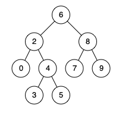

## Problem

Given a binary search tree (BST), find the lowest common ancestor (LCA) node of two given nodes in the BST.

According to the [definition of LCA on Wikipedia](https://en.wikipedia.org/wiki/Lowest_common_ancestor): “The lowest common ancestor is defined between two nodes `p` and `q` as the lowest node in `T` that has both `p` and `q` as descendants (where we allow **a node to be a descendant of itself**).”

<https://leetcode.com/problems/lowest-common-ancestor-of-a-binary-search-tree/>

**Example 1:**

{.invert-when-dark}

> Input: `root = [6,2,8,0,4,7,9,null,null,3,5], p = 2, q = 8`
> Output: `6`
> Explanation: The LCA of nodes `2` and `8` is `6`.

**Example 2:**

{.invert-when-dark}

> Input: `root = [6,2,8,0,4,7,9,null,null,3,5], p = 2, q = 4`
> Output: `2`
> Explanation: The LCA of nodes `2` and `4` is `2`, since a node can be a descendant of itself according to the LCA definition.

**Example 3:**

> Input: `root = [2,1], p = 2, q = 1`
> Output: `2`

**Constraints:**

- The number of nodes in the tree is in the range `[2, 10⁵]`.
- `-10⁹ <= Node.val <= 10⁹`
- All `Node.val` are **unique**.
- `p != q`
- `p` and `q` will exist in the BST.

## Test Cases

```python
# Definition for a binary tree node.
# class TreeNode:
#     def __init__(self, x):
#         self.val = x
#         self.left = None
#         self.right = None

class Solution:
    def lowestCommonAncestor(self, root: 'TreeNode', p: 'TreeNode', q: 'TreeNode') -> 'TreeNode':
```



## Thoughts

不妨设 `p < q`，显然在 BST 中，`p` 和 `q` 的 LCA 满足 `p <= lca(p, q) <= q`。更高的祖先要么同时小于 `p` 和 `q`，要么同时大于它俩。

从根节点出发，如果节点的值刚好介于 `p` 和 `q` 之间，就是 LCA。否则如果比 `p` 和 `q` 都大，就进入左子树；反之则进入右子树。

## Code


