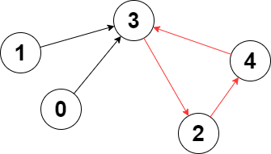
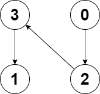

## Problem

You are given a **directed** graph of `n` nodes numbered from `0` to `n - 1`, where each node has **at most one** outgoing edge.

The graph is represented with a given **0-indexed** array `edges` of size `n`, indicating that there is a directed edge from node `i` to node `edges[i]`. If there is no outgoing edge from node `i`, then `edges[i] == -1`.

Return _the length of the **longest** cycle in the graph_. If no cycle exists, return `-1`.

A cycle is a path that starts and ends at the **same** node.

<https://leetcode.com/problems/longest-cycle-in-a-graph/>

**Example 1:**





> Input: `edges = [3,3,4,2,3]`
> Output: `3`
> Explanation: The longest cycle in the graph is the cycle: `2 -> 4 -> 3 -> 2`.
> The length of this cycle is 3, so 3 is returned.

**Example 2:**





> Input: `edges = [2,-1,3,1]`
> Output: `-1`
> Explanation: There are no cycles in this graph.

**Constraints:**

- `n == edges.length`
- `2 <= n <= 10⁵`
- `-1 <= edges[i] < n`
- `edges[i] != i`

## Test Cases

``` python
class Solution:
    def longestCycle(self, edges: List[int]) -> int:
```



## Thoughts

任意图求最大环，类似于计算哈密顿回路，是 NP 难问题。本题是加了限定条件的图。

相当于简版的 [2127. Maximum Employees to Be Invited to a Meeting](2127-maximum-employees-to-be-invited-to-a-meeting)，只是每个顶点的入度从严格为 1 变为小于等于 1，然后也不需要计算长度为 2 的环两头的拉链长度。

直接在 [problem 2127 第二个方法——拓扑排序](2127-maximum-employees-to-be-invited-to-a-meeting#Faster) 的代码上改一改就行了。

## Code



## Simpler

之前在 [problem 2127](2127-maximum-employees-to-be-invited-to-a-meeting#Faster) 中拓扑排序是为了能计算出「环上的每个顶点，指向它的无环边的最大长度」。本题并不需要这个信息，除了在拓扑排序过程中不在记录 `d(u)` 值，整个处理逻辑都可以进一步简化。

假设从一个顶点 u 出发，如果会进入环路，则一定会遇到出发后曾经见过的某个顶点，不妨设每一秒移动一次，那么两次遇到同一个顶点的时间之差，就是环长。

如下图，从 u 出发，记出发时间为 `t = 1`。第一次经过 v 的时间是 `t = 3`，到 `t = 8` 时再次访问 v，说明有环，且环长为 `8 - 3 = 5`。





为了避免重复处理，每个顶点经过的时间都记录下来，曾经访问过的顶点就不再访问了。

但是像上图那样，当第二次访问到 v，发现 v 已经被访问过，需要能够知道是本轮（从 u 出发后）才访问的，还是之前就已经访问过。一个简单的方法就是让时间一直递增下去，这样本轮的出发时刻就一定比之前所有节点被访问的时刻都靠后。

时间和空间复杂度都是 O(n)。


