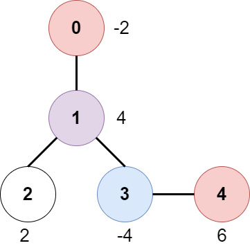

## Problem

There is an undirected tree with `n` nodes labeled from `0` to `n - 1`, rooted at node `0`. You are given a 2D integer array `edges` of length `n - 1` where `edges[i] = [aᵢ, bᵢ]` indicates that there is an edge between nodes `aᵢ` and `bᵢ` in the tree.

At every node `i`, there is a gate. You are also given an array of even integers `amount`, where `amount[i]` represents:

- the price needed to open the gate at node `i`, if `amount[i]` is negative, or,
- the cash reward obtained on opening the gate at node `i`, otherwise.

The game goes on as follows:

- Initially, Alice is at node `0` and Bob is at node `bob`.
- At every second, Alice and Bob **each** move to an adjacent node. Alice moves towards some **leaf node**, while Bob moves towards node `0`.
- For **every** node along their path, Alice and Bob either spend money to open the gate at that node, or accept the reward. Note that:
  - If the gate is **already open**, no price will be required, nor will there be any cash reward.
  - If Alice and Bob reach the node **simultaneously**, they share the price/reward for opening the gate there. In other words, if the price to open the gate is `c`, then both Alice and Bob pay `c / 2` each. Similarly, if the reward at the gate is `c`, both of them receive `c / 2` each.
- If Alice reaches a leaf node, she stops moving. Similarly, if Bob reaches node `0`, he stops moving. Note that these events are **independent** of each other.

Return _the **maximum** net income Alice can have if she travels towards the optimal leaf node._

<https://leetcode.com/problems/most-profitable-path-in-a-tree/>

**Example 1:**





> Input: `edges = [[0,1],[1,2],[1,3],[3,4]], bob = 3, amount = [-2,4,2,-4,6]`
> Output: `6`
> Explanation:
> The above diagram represents the given tree. The game goes as follows:
>
> - Alice is initially on node 0, Bob on node 3. They open the gates of their respective nodes.
> Alice's net income is now -2.
>
> - Both Alice and Bob move to node 1.
> Since they reach here simultaneously, they open the gate together and share the reward.
> Alice's net income becomes `-2 + (4 / 2) = 0`.
>
> - Alice moves on to node 3. Since Bob already opened its gate, Alice's income remains unchanged.
> Bob moves on to node 0, and stops moving.
>
> - Alice moves on to node 4 and opens the gate there. Her net income becomes `0 + 6 = 6`.
> Now, neither Alice nor Bob can make any further moves, and the game ends.
>
> It is not possible for Alice to get a higher net income.

**Example 2:**





> Input: `edges = [[0,1]], bob = 1, amount = [-7280,2350]`
> Output: `-7280`
> Explanation:
> Alice follows the path `0->1` whereas Bob follows the path `1->0`.
> Thus, Alice opens the gate at node 0 only. Hence, her net income is -7280.

**Constraints:**

- `2 <= n <= 10⁵`
- `edges.length == n - 1`
- `edges[i].length == 2`
- `0 <= aᵢ, bᵢ < n`
- `aᵢ != bᵢ`
- `edges` represents a valid tree.
- `1 <= bob < n`
- `amount.length == n`
- `amount[i]` is an **even** integer in the range `[-10⁴, 10⁴]`.

## Test Cases

``` python
class Solution:
    def mostProfitablePath(self, edges: List[List[int]], bob: int, amount: List[int]) -> int:
```



## Thoughts

可以先把 Bob 对 amount 的影响确定下来。从根节点 0 到 bob 所在节点的路径可以求出来，设这条路径一共有 h 个节点，下边 `⌊h/2⌋` 个节点的门一定会被 Bob 开启，可以将这些节点的 profit 改为 0；上边 `⌊h/2⌋` 个节点，如果 Alice 经过则对应的 profit 全部归 Alice，而如果 Alice 不经过，则是否被 Bob 拿走也毫无影响。如果 h 是奇数，那么正中的节点，如果 Alice 经过则一定会跟 Bob 同时经过，profit（绝对值）减半。

直接 in-place 更新好 amount，之后就不用再关注 Bob 了。

对于 Alice，定义 `dp(u)` 表示在以 u 为根节点的子树，Alice 可以得到的最大 profit。题目所求即为 `dp(0)`。

易知状态转移公式为：

$$
dp(u)=amount[u]+\max_{v\in u.children}{dp(v)}
$$

用后序遍历（post-order），先计算所有子节点的 dp 值，再计算当前节点。

## Code


