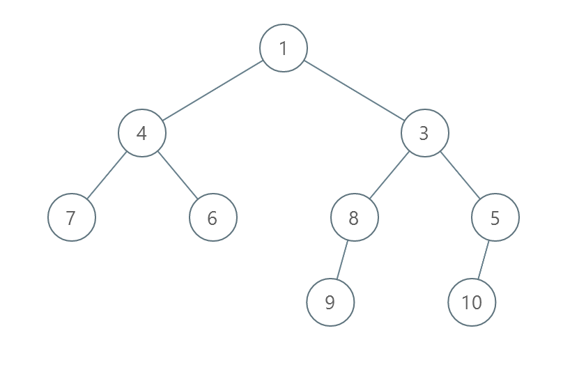
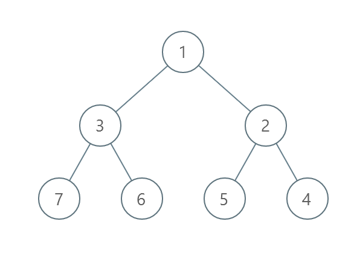
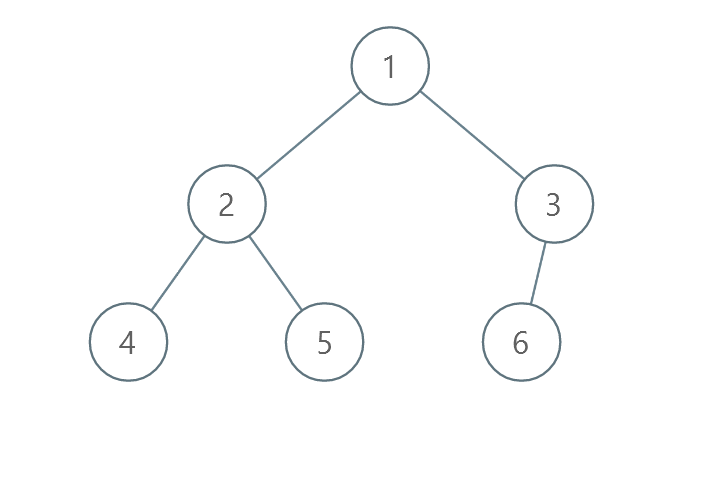

## Problem

You are given the `root` of a binary tree with **unique values**.

In one operation, you can choose any two nodes **at the same level** and swap their values.

Return _the minimum number of operations needed to make the values at each level sorted in a **strictly increasing order**_.

The **level** of a node is the number of edges along the path between it and the root node.

<https://leetcode.com/problems/minimum-number-of-operations-to-sort-a-binary-tree-by-level/>

**Example 1:**

{.invert-when-dark}

> Input: `root = [1,4,3,7,6,8,5,null,null,null,null,9,null,10]`
> Output: `3`
> Explanation:
>
> - Swap 4 and 3. The 2nd level becomes `[3,4]`.
> - Swap 7 and 5. The 3rd level becomes `[5,6,8,7]`.
> - Swap 8 and 7. The 3rd level becomes `[5,6,7,8]`.
>
> We used 3 operations so return 3.
> It can be proven that 3 is the minimum number of operations needed.

**Example 2:**

{.invert-when-dark}

> Input: `root = [1,3,2,7,6,5,4]`
> Output: `3`
> Explanation:
>
> - Swap 3 and 2. The 2nd level becomes `[2,3]`.
> - Swap 7 and 4. The 3rd level becomes `[4,6,5,7]`.
> - Swap 6 and 5. The 3rd level becomes `[4,5,6,7]`.
>
> We used 3 operations so return 3.
> It can be proven that 3 is the minimum number of operations needed.

**Example 3:**

{.invert-when-dark}

> Input: `root = [1,2,3,4,5,6]`
> Output: `0`
> Explanation: Each level is already sorted in increasing order so return 0.

**Constraints:**

- The number of nodes in the tree is in the range `[1, 10⁵]`.
- `1 <= Node.val <= 10⁵`
- All the values of the tree are **unique**.

## Test Cases

``` python
# Definition for a binary tree node.
# class TreeNode:
#     def __init__(self, val=0, left=None, right=None):
#         self.val = val
#         self.left = left
#         self.right = right
class Solution:
    def minimumOperations(self, root: Optional[TreeNode]) -> int:
```



## Thoughts

按层序（level-order）遍历二叉树，可以类似 [2415. Reverse Odd Levels of Binary Tree](../2415-reverse-odd-levels-of-binary-tree/index.md) 那样直接一层一层地取出一层的所有节点。

对于某一层，计算调至有序所需的最少交换次数。

对于 m 个（各不相同的）的数字，先计算出排序的结果，然后拿原始数组跟排序结果比较。任选一个数字，如果它的位置在排序前后不变，就不需要交换（或者说交换 `1 - 1 = 0` 次）。否则一定可以找到一组数，这一组数轮换一圈就可以全部归位。如果这一组数有 k 个，则需要交换 `k - 1` 次。

最终可以把 m 个数字分成若干组，每组数字是一个轮换循环。可见如果有 r 组，则总共需要交换 `m - r` 次。

由于每个数字都各不相同，数字本身的值就不重要了，可以把每个数字的下标取出来，按照数字的大小对下标排序。

比如 `m = 8` 个数字为 `[5, 1, 3, 2, 4, 7, 6, 8]`，按数字大小排序的下标为 `[1, 3, 2, 4, 0, 6, 5, 7]`：

::: invert-when-dark

:::

对按数字排序的下标数组找出轮换循环，易知共有四个轮换循环组：

::: invert-when-dark

:::

所以原始的数组需要进行 `8 - 4 = 4` 次两两交换。

整体最坏时间复杂度是 `O(n log n)`，空间复杂度 `O(n)`。

## Code


