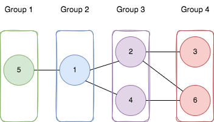
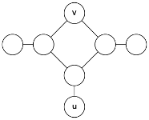

## Problem

You are given a positive integer `n` representing the number of nodes in an **undirected** graph. The nodes are labeled from `1` to `n`.

You are also given a 2D integer array `edges`, where `edges[i] = [aᵢ, bᵢ]` indicates that there is a **bidirectional** edge between nodes `aᵢ` and `bᵢ`. **Notice** that the given graph may be disconnected.

Divide the nodes of the graph into `m` groups (**1-indexed**) such that:

- Each node in the graph belongs to exactly one group.
- For every pair of nodes in the graph that are connected by an edge `[aᵢ, bᵢ]`, if `aᵢ` belongs to the group with index `x`, and `bᵢ` belongs to the group with index `y`, then `|y - x| = 1`.

Return _the maximum number of groups (i.e., maximum_ `m`_) into which you can divide the nodes_. Return `-1` _if it is impossible to group the nodes with the given conditions_.

<https://leetcode.com/problems/divide-nodes-into-the-maximum-number-of-groups/>

**Example 1:**





> Input: `n = 6, edges = [[1,2],[1,4],[1,5],[2,6],[2,3],[4,6]]`
> Output: `4`
> Explanation: As shown in the image we:
>
> - Add node 5 to the first group.
> - Add node 1 to the second group.
> - Add nodes 2 and 4 to the third group.
> - Add nodes 3 and 6 to the fourth group.
>
> We can see that every edge is satisfied.
> It can be shown that that if we create a fifth group and move any node from the third or fourth group to it, at least on of the edges will not be satisfied.

**Example 2:**

> Input: `n = 3, edges = [[1,2],[2,3],[3,1]]`
> Output: `-1`
> Explanation: If we add node 1 to the first group, node 2 to the second group, and node 3 to the third group to satisfy the first two edges, we can see that the third edge will not be satisfied.
> It can be shown that no grouping is possible.

**Constraints:**

- `1 <= n <= 500`
- `1 <= edges.length <= 10⁴`
- `edges[i].length == 2`
- `1 <= aᵢ, bᵢ <= n`
- `aᵢ != bᵢ`
- There is at most one edge between any pair of vertices.

## Test Cases

``` python
class Solution:
    def magnificentSets(self, n: int, edges: List[List[int]]) -> int:
```



## Thoughts

首先只有二部图才能进行这样的分组。二部图的判定在 [785. Is Graph Bipartite?](785-is-graph-bipartite) 中做了（支持非连通图），可以搬过来用。

如果整张图可以划分为几个各不相连的子图，那么求出每个子图的最大分组数量，总和就是题目的答案。

对于一个连通子图，只要计算出其直径（the length of the _longest_ path between any two nodes in the graph），显然按照直径所在的路径排出来的分组数一定是最多的，数量等于图的直径加一。

开始直接搬 [3203. Find Minimum Diameter After Merging Two Trees](3203-find-minimum-diameter-after-merging-two-trees) 里面计算直径的逻辑，结果不对。那里的快速计算方法只适用于树，在有环的情况下不一定能计算正确。

> 比如下图，如果初始节点是 v，第一次 DFS 会找到 u，再从 u 出发得到的「直径」是 3。但此图的直径其实是 4。
> 


> （图片出自 <https://cs.stackexchange.com/a/213>）

只能是按广度优先搜索（BFS），计算出从每一个节点出发能得到的最大路径长度，取最大值则为直径。

在做 BFS 的时候，因为要计算出最大的路径长度（深度），可以像层序遍历树/二叉树那样，直接一层一层地处理（如 [515. Find Largest Value in Each Tree Row](515-find-largest-value-in-each-tree-row)），更直接地跟踪深度。

另外在计算连通子图的直径的时候，对子图中的所有节点都标记上「已处理」，这样直接在外层对所有顶点做一次扫描，就可以确保所有子图都处理一次且仅一次（不用像 [721. Accounts Merge](721-accounts-merge) 那样先弄一个 disjoint set，再把每个子图筛出来）。

## Code


