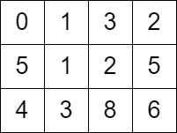
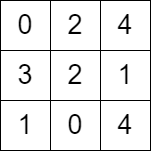

## Problem

You are given a `m x n` matrix `grid` consisting of **non-negative** integers where `grid[row][col]` represents the **minimum** time required to be able to visit the cell `(row, col)`, which means you can visit the cell `(row, col)` only when the time you visit it is greater than or equal to `grid[row][col]`.

You are standing in the **top-left** cell of the matrix in the `0ᵗʰ` second, and you must move to **any** adjacent cell in the four directions: up, down, left, and right. Each move you make takes 1 second.

Return _the **minimum** time required in which you can visit the bottom-right cell of the matrix_. If you cannot visit the bottom-right cell, then return `-1`.

<https://leetcode.com/problems/minimum-time-to-visit-a-cell-in-a-grid/>

**Example 1:**





> Input: `grid = [[0,1,3,2],[5,1,2,5],[4,3,8,6]]`
> Output: `7`
> Explanation: One of the paths that we can take is the following:
>
> - at `t = 0`, we are on the cell `(0,0)`.
> - at `t = 1`, we move to the cell `(0,1)`. It is possible because `grid[0][1] <= 1`.
> - at `t = 2`, we move to the cell `(1,1)`. It is possible because `grid[1][1] <= 2`.
> - at `t = 3`, we move to the cell `(1,2)`. It is possible because `grid[1][2] <= 3`.
> - at `t = 4`, we move to the cell `(1,1)`. It is possible because `grid[1][1] <= 4`.
> - at `t = 5`, we move to the cell `(1,2)`. It is possible because `grid[1][2] <= 5`.
> - at `t = 6`, we move to the cell `(1,3)`. It is possible because `grid[1][3] <= 6`.
> - at `t = 7`, we move to the cell `(2,3)`. It is possible because `grid[2][3] <= 7`.
> The final time is 7. It can be shown that it is the minimum time possible.

**Example 2:**





> Input: `grid = [[0,2,4],[3,2,1],[1,0,4]]`
> Output: `-1`
> Explanation: There is no path from the top left to the bottom-right cell.

**Constraints:**

- `m == grid.length`
- `n == grid[i].length`
- `2 <= m, n <= 1000`
- `4 <= m * n <= 10⁵`
- `0 <= grid[i][j] <= 10⁵`
- `grid[0][0] == 0`

## Test Cases

``` python
class Solution:
    def minimumTime(self, grid: List[List[int]]) -> int:
```



## Thoughts

跟 [2290. Minimum Obstacle Removal to Reach Corner](/coding/2290-minimum-obstacle-removal-to-reach-corner) 很像，就是边的权重定义不一样。

首先如果 `grid[0][1]` 和 `grid[1][0]` 都大于 1 就无解，因为第一步就没得走。

以每个格子作为顶点，上下左右相邻的格子之间作边，作有权无向图。

因为能不能移动到某个格子，跟到达的时间有关，所以边的权重也不是静态的，而是跟访问这条边的时间有关。

设在 `t` 秒时位于格子 `u`，看如何能移动到 `u` 周围的其他格子。取 `u` 上下左右的某个格子 `v`，如果 `v` 的值小于等于 `t + 1`，那么可以直接移动过去，且到达的时间即为 `t + 1`。否则就不能直接走到 `v`，但是可以在 `u` 和进入 `u` 之前的那个格子之间来回移动消耗时间，直到 `t' + 1 >= grid[v]`。因为每次来回都是用 2 秒，所以可以走到 `v` 的最早时间是 `grid[v]` 或 `grid[v] + 1`（取决于 `grid[v] - t` 的奇偶性）。

直接用 Dijkstra 算法，在 [problem 2290](/coding/2290-minimum-obstacle-removal-to-reach-corner) 代码的基础上改造一下从 `u` 移动到 `v` 之后，`v` 的到达时间（等价于距离）的计算逻辑。

时间复杂度同样是 `O(m*n log (m*n))`。

## Code


