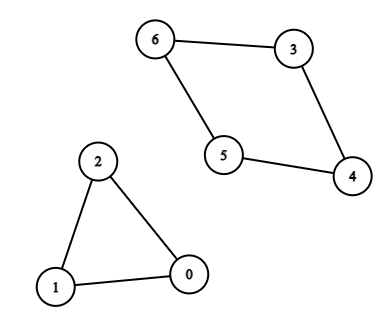
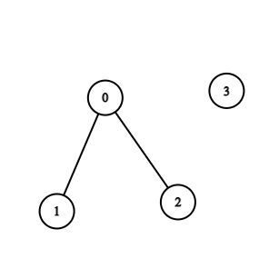

## Problem

There is a **bi-directional** graph with `n` vertices, where each vertex is labeled from `0` to `n - 1`. The edges in the graph are represented by a given 2D integer array `edges`, where `edges[i] = [uᵢ, vᵢ]` denotes an edge between vertex `uᵢ` and vertex `vᵢ`. Every vertex pair is connected by at most one edge, and no vertex has an edge to itself.

Return _the length of the **shortest** cycle in the graph_. If no cycle exists, return `-1`.

A cycle is a path that starts and ends at the same node, and each edge in the path is used only once.

<https://leetcode.com/problems/shortest-cycle-in-a-graph/>

**Example 1:**





> Input: `n = 7, edges = [[0,1],[1,2],[2,0],[3,4],[4,5],[5,6],[6,3]]`
> Output: `3`
> Explanation: The cycle with the smallest length is : `0 -> 1 -> 2 -> 0`.

**Example 2:**





> Input: `n = 4, edges = [[0,1],[0,2]]`
> Output: `-1`
> Explanation: There are no cycles in this graph.

**Constraints:**

- `2 <= n <= 1000`
- `1 <= edges.length <= 1000`
- `edges[i].length == 2`
- `0 <= uᵢ, vᵢ < n`
- `uᵢ != vᵢ`
- There are no repeated edges.

## Test Cases

``` python
class Solution:
    def findShortestCycle(self, n: int, edges: List[List[int]]) -> int:
```



## Thoughts

从任意顶点 r 出发，广度优先搜索（BFS），如果遇到见过的顶点则说明走遍了一个完整的环。定义 `d(u)` 表示从 r 出发，走到 u 的路径长度（初值 `d(r) = 0`）。如果在处理边 `(u, v)` 的时候发现 v 已经见过了，那么 `d(u) + d(v) + 1` 一定不比环长小。

如果 r 刚好在环上，则环长等于 `d(u) + d(v) + 1`，而且易知这就是经过 r 的最小的环。如：





如果 r 不在环上，则环长小于 `d(u) + d(v) + 1`。如：





对所有的顶点进行同样的处理，一定可以（当起点是最小环上的某个顶点的时候）得到最小的环长。

一次 BFS 的时间复杂度是 `O(E)`，总计时间复杂度 `O(n * E)`，空间复杂度 `O(n + E)`。

## Code



## Faster

对于一条边 `(u, v)`，想得到包含该边的最短环长，可以先把这条边删掉，然后计算 u 到 v 的最短距离（Dijkstra 算法，参见 [2290. Minimum Obstacle Removal to Reach Corner](../2290-minimum-obstacle-removal-to-reach-corner/index.md)）。如果 u 和 v 是可达的，最短距离为 dis，那么包含边 `(u, v)` 的最短环长为 `dis + 1`。否则 `(u, v)` 不在任何环上。

因为本来就要根据给定的边集 edges 构建图，构建的过程就是依次把每条边加进去。那么可以在构建的过程中，对于每一条将要加入的边 `(u, v)`，在加入之前先在已有的图中计算 u 到 v 的最短距离，从而确定包含边 `(u, v)` 的最短环长。这样最小环的最后一条边被加入的前一刻，一定可以得到最小环长。

最坏时间复杂度是 `O(E * n)`。空间复杂度 `O(n + E)`。


