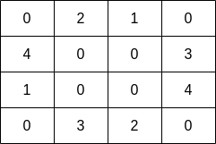
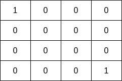

## Problem

You are given a **0-indexed** 2D matrix `grid` of size `m x n`, where `(r, c)` represents:

- A **land** cell if `grid[r][c] = 0`, or
- A **water** cell containing `grid[r][c]` fish, if `grid[r][c] > 0`.

A fisher can start at any **water** cell `(r, c)` and can do the following operations any number of times:

- Catch all the fish at cell `(r, c)`, or
- Move to any adjacent **water** cell.

Return _the **maximum** number of fish the fisher can catch if he chooses his starting cell optimally, or_ `0` if no water cell exists.

An **adjacent** cell of the cell `(r, c)`, is one of the cells `(r, c + 1)`, `(r, c - 1)`, `(r + 1, c)` or `(r - 1, c)` if it exists.

<https://leetcode.com/problems/maximum-number-of-fish-in-a-grid/>

**Example 1:**





> Input: `grid = [[0,2,1,0],[4,0,0,3],[1,0,0,4],[0,3,2,0]]`
> Output: `7`
> Explanation: The fisher can start at cell `(1,3)` and collect 3 fish, then move to cell `(2,3)` and collect 4 fish.

**Example 2:**





> Input: `grid = [[1,0,0,0],[0,0,0,0],[0,0,0,0],[0,0,0,1]]`
> Output: `1`
> Explanation: The fisher can start at cells `(0,0)` or `(3,3)` and collect a single fish.

**Constraints:**

- `m == grid.length`
- `n == grid[i].length`
- `1 <= m, n <= 10`
- `0 <= grid[i][j] <= 10`

## Test Cases

``` python
class Solution:
    def findMaxFish(self, grid: List[List[int]]) -> int:
```



## Thoughts

跟 [200. Number of Islands](200-number-of-islands) 类似，同样是漫填充算法。

扫描整个区域，如果是陆地则跳过；如果是水，则把鱼收走，并把此位置标记为陆地，将此位置放入栈。每次出栈的位置，都继续检查其上下左右的位置，做同样的判断和处理。

时间复杂度 `O(m * n)`，空间复杂度 `O(m * n)`（栈的大小）。

## Code


