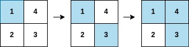
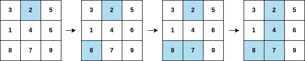

## Problem

You are given a **0-indexed** integer array `arr`, and an `m x n` integer **matrix** `mat`. `arr` and `mat` both contain **all** the integers in the range `[1, m * n]`.

Go through each index `i` in `arr` starting from index `0` and paint the cell in `mat` containing the integer `arr[i]`.

Return _the smallest index_ `i` _at which either a row or a column will be completely painted in_ `mat`.

<https://leetcode.com/problems/first-completely-painted-row-or-column/>

**Example 1:**





> Input: `arr = [1,3,4,2], mat = [[1,4],[2,3]]`
> Output: `2`
> Explanation: The moves are shown in order, and both the first row and second column of the matrix become fully painted at arr`[2]`.

**Example 2:**





> Input: `arr = [2,8,7,4,1,3,5,6,9], mat = [[3,2,5],[1,4,6],[8,7,9]]`
> Output: `3`
> Explanation: The second column becomes fully painted at `arr[3]`.

**Constraints:**

- `m == mat.length`
- `n = mat[i].length`
- `arr.length == m * n`
- `1 <= m, n <= 10⁵`
- `1 <= m * n <= 10⁵`
- `1 <= arr[i], mat[r][c] <= m * n`
- All the integers of `arr` are **unique**.
- All the integers of `mat` are **unique**.

## Test Cases

``` python
class Solution:
    def firstCompleteIndex(self, arr: List[int], mat: List[List[int]]) -> int:
```



## Thoughts

先遍历一次 mat，记录每个数字所在的行和列，以便在遍历 arr 时能快速查出涂色的格子位置。

记录每一行未涂色的格子数（初值为 n）、每一列未涂色的格子数（初值为 m）。遍历 arr，对于每个数字，查到其在 mat 中的行号和列号，给对应行和列未涂色格子数分别减去 1。如果行或列的未涂色格子数降为 0，则返回当前 arr 的下标。

时间复杂度 `O(m * n)`，空间复杂度 `O(m * n)`。

## Code


