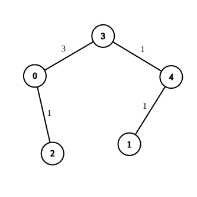
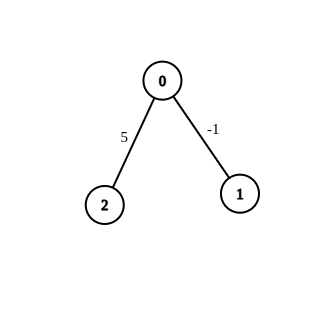
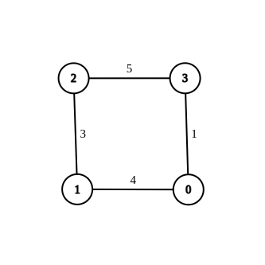

## Problem

You are given an **undirected weighted** **connected** graph containing `n` nodes labeled from `0` to `n - 1`, and an integer array `edges` where `edges[i] = [aᵢ, bᵢ, wᵢ]` indicates that there is an edge between nodes `aᵢ` and `bᵢ` with weight `wᵢ`.

Some edges have a weight of `-1` (`wᵢ = -1`), while others have a **positive** weight (`wᵢ > 0`).

Your task is to modify **all edges** with a weight of `-1` by assigning them **positive integer values** in the range `[1, 2 * 10⁹]` so that the **shortest distance** between the nodes `source` and `destination` becomes equal to an integer `target`. If there are **multiple** **modifications** that make the shortest distance between `source` and `destination` equal to `target`, any of them will be considered correct.

Return _an array containing all edges (even unmodified ones) in any order if it is possible to make the shortest distance from_ `source` _to_ `destination` _equal to_ `target`_, or an **empty array** if it's impossible._

**Note:** You are not allowed to modify the weights of edges with initial positive weights.

<https://leetcode.com/problems/modify-graph-edge-weights/>

**Example 1:**





> Input: `n = 5, edges = [[4,1,-1],[2,0,-1],[0,3,-1],[4,3,-1]], source = 0, destination = 1, target = 5`
> Output: `[[4,1,1],[2,0,1],[0,3,3],[4,3,1]]`
> Explanation: The graph above shows a possible modification to the edges, making the distance from `0` to `1` equal to 5.

**Example 2:**





> Input: `n = 3, edges = [[0,1,-1],[0,2,5]], source = 0, destination = 2, target = 6`
> Output: `[]`
> Explanation: The graph above contains the initial edges. It is not possible to make the distance from `0` to `2` equal to 6 by modifying the edge with weight -1. So, an empty array is returned.

**Example 3:**





> Input: `n = 4, edges = [[1,0,4],[1,2,3],[2,3,5],[0,3,-1]], source = 0, destination = 2, target = 6`
> Output: `[[1,0,4],[1,2,3],[2,3,5],[0,3,1]]`
> Explanation: The graph above shows a modified graph having the shortest distance from `0` to `2` as 6.

**Constraints:**

- `1 <= n <= 100`
- `1 <= edges.length <= n * (n - 1) / 2`
- `edges[i].length == 3`
- `0 <= aᵢ, bᵢ < n`
- `wᵢ = -1` or `1 <= wᵢ <= 10⁷`
- `aᵢ != bᵢ`
- `0 <= source, destination < n`
- `source != destination`
- `1 <= target <= 10⁹`
- The graph is connected, and there are no self-loops or repeated edges

## Test Cases

``` python
class Solution:
    def modifiedGraphEdges(self, n: int, edges: List[List[int]], source: int, destination: int, target: int) -> List[List[int]]:
```



## Thoughts

> 先要实现一番测试代码，因为结果的不确定性，需要单独验证结果是否正确。在测试代码中用 Dijkstra 算法对 `Solution.modifiedGraphEdges` 返回的边的信息，计算 `source` 到 `destination` 的最短距离，看是不是刚好等于 `target`。

首先假设那些权重为 -1 的边（简称「-1 边」）都不存在，调用 Dijkstra 算法计算 `source` 到 `destination` 的最短距离，记为 dist（不通则为 ∞）。显然如果 `dist < target`，那就无解（类似于 Example 2），直接返回空数组。如果 `dist = target` 那就不需要做任何有意义的修改（当然题目要求所有 -1 边都必须改成 `[1, 2 * 10⁹]` 内的正数，那就全都改成 `2 * 10⁹` 即可）。如果 `dist > target` 但是 `edges` 中没有 -1 边，也无解，直接返回空数组。

> Dijkstra 算法的更多信息在 [2290. Minimum Obstacle Removal to Reach Corner](2290-minimum-obstacle-removal-to-reach-corner) 有提到。

然后把所有 -1 边的权重都临时改为 1，再调用 Dijkstra 算法计算 `source` 到 `destination` 的最短距离，同样记为 dist。如果 `dist > target` 说明怎么改都无法把最短距离缩减到 `target`，直接返回空数组。如果 `dist = target`，那么把最短路径上所有 -1 边的权重都改为 1（同时按题目要求把其他 -1 边的权重改成 `2 * 10⁹`）即可。

如果 `dist < target` 就会麻烦一些。一个想法是令 `gap = target - dist`，在最短路径上任选一条 -1 边，将其权重改为 `1 + gap`（其他的都改为 1）。但这样改完之后，`source` 到 `destination` 的最短路径可能会变化，导致最短距离变得小于 `target`，比如下面这个情况（`source = 0, destination = 3, target = 10`）：





把所有 -1 边的权重改成 1 之后，找到最短路径 `0 - 1 - 2 - 3`（蓝色），距离为 `dist = 3`。如果把 `target - dist = 7` 随机地加到了边 `(1, 2)` 上，就会导致最短路径变成 `0 - 1 - 3`（红色），距离为 6，小于 `target` 了。

可以按最新的权重重新计算 `source` 到 `destination` 的最短距离，如果得到了比 `target` 小的最短距离，就再任选一条 -1 边，把新的到 gap 加上去。比如上图中，新的 `gap` 值为 4，任选一条红色路径上的 -1 边（如 `(0, 1)`），把 4 加上去，得到下图的结果：





重复这一操作直到最短距离等于 `target`。

所以至少需要做两次 Dijkstra 最短路径计算，时间是 `O((E + n) log n)`（其中 E 是 `edges` 的长度）。但是在调整 -1 边权重的时候，最坏情况可能会需要重新计算 `O(n)` 次最短路径，总的时间复杂度为 `O(n (E + n) log n)`，约等于 `O(n³ log n)`（因为 `O(E) ≈ O(n²)`）。空间复杂度 `O(E)`。

提交之后运行时间还可以，`97+%`。

还有一个调整权重的方法，对于一条在最短路径上的 -1 边 `(u, v)`，取 `source` 到 `u` 的最短距离 `dist1`，和 `v` 到 `destination` 的最短距离 `dist2`，那么把 `(u, v)` 的权重改成 `target - dist1 - dist2`。但是这个操作不能连续执行，修改完一条 -1 边的权重之后，对于另外一条 -1 边 `(u', v')`，需要重新计算 `dist1'` 和 `dist2'`，复杂度是差不多的。

## Code


