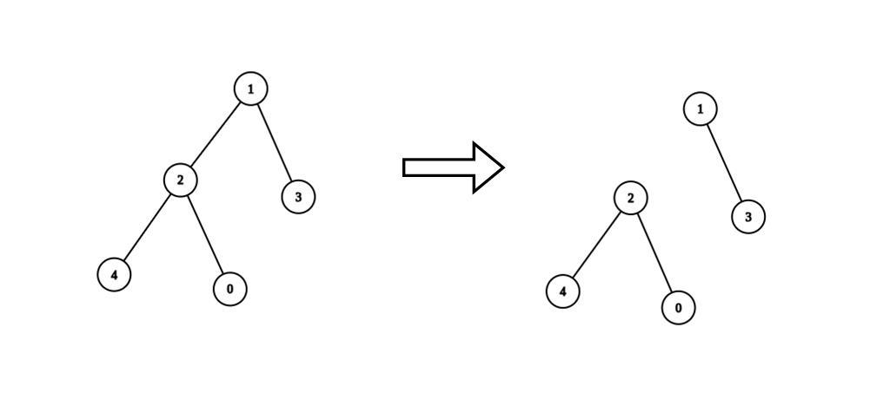
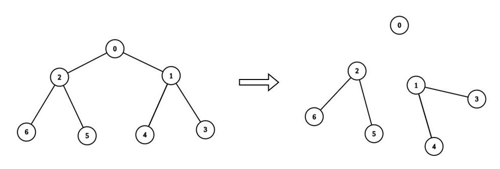

## Problem

There is an undirected tree with `n` nodes labeled from `0` to `n - 1`. You are given the integer `n` and a 2D integer array `edges` of length `n - 1`, where `edges[i] = [aᵢ, bᵢ]` indicates that there is an edge between nodes `aᵢ` and `bᵢ` in the tree.

You are also given a **0-indexed** integer array `values` of length `n`, where `values[i]` is the **value** associated with the `iᵗʰ` node, and an integer `k`.

A **valid split** of the tree is obtained by removing any set of edges, possibly empty, from the tree such that the resulting components all have values that are divisible by `k`, where the **value of a connected component** is the sum of the values of its nodes.

Return _the **maximum number of components** in any valid split_.

<https://leetcode.com/problems/maximum-number-of-k-divisible-components/>

**Example 1:**

{.invert-when-dark}

> Input: `n = 5, edges = [[0,2],[1,2],[1,3],[2,4]], values = [1,8,1,4,4], k = 6`
> Output: `2`
> Explanation: We remove the edge connecting node 1 with 2. The resulting split is valid because:
>
> - The value of the component containing nodes 1 and 3 is `values[1] + values[3] = 12`.
> - The value of the component containing nodes 0, 2, and 4 is `values[0] + values[2] + values[4] = 6`.
>
> It can be shown that no other valid split has more than 2 connected components.

**Example 2:**

{.invert-when-dark}

> Input: `n = 7, edges = [[0,1],[0,2],[1,3],[1,4],[2,5],[2,6]], values = [3,0,6,1,5,2,1], k = 3`
> Output: `3`
> Explanation: We remove the edge connecting node 0 with 2, and the edge connecting node 0 with 1. The resulting split is valid because:
>
> - The value of the component containing node 0 is `values[0] = 3`.
> - The value of the component containing nodes 2, 5, and 6 is `values[2] + values[5] + values[6] = 9`.
> - The value of the component containing nodes 1, 3, and 4 is `values[1] + values[3] + values[4] = 6`.
>
> It can be shown that no other valid split has more than 3 connected components.

**Constraints:**

- `1 <= n <= 3 * 10⁴`
- `edges.length == n - 1`
- `edges[i].length == 2`
- `0 <= aᵢ, bᵢ < n`
- `values.length == n`
- `0 <= values[i] <= 10⁹`
- `1 <= k <= 10⁹`
- Sum of `values` is divisible by `k`.
- The input is generated such that `edges` represents a valid tree.

## Test Cases

```python
class Solution:
    def maxKDivisibleComponents(self, n: int, edges: List[List[int]], values: List[int], k: int) -> int:
```



## Thoughts

任选一条边，两头各有一棵子树，如果其中一棵子树的节点的 value 之和可以被 k 整除，那么这条边就可以断开。

可以选任意节点作为树根 root。对于某个节点 u，记 `s(u)` 表示以 u 为根节点的子树的各节点 value 之和。如果 `s(u) % k = 0`，就可以把以 u 为根节点的子树拆出去成为独立的部分。显然 `s(root) % k = 0`。所以一共有几个节点的 s 值能被 k 整除，就可以把原树拆分成几个部分，这些节点就是各个独立部分的子树树根（可能只有一个节点）。

问题就转变为，求所有节点的 s 值。可以用后序遍历，$s(u)=\sum_v{s_v}$，其中 v 是 u 的所有子节点。

二叉树的后序遍历可以参考 [124. Binary Tree Maximum Path Sum](../124-binary-tree-maximum-path-sum/index.md) 或 [337. House Robber III](../337-house-robber-iii/index.md)。但是普通的树，每个节点可以有任意多个子节点，就需要在子节点入栈前，把当前节点再次入栈，并附带上标记，当它带着标记出栈的时候，就可以知道它的子节点已经都处理完了。

另外提供的数据中没有明确表明谁是谁的父节点，可以在遍历过程中记录是从哪个节点访问过来的。

时间复杂度 `O(n)`，空间复杂度 `O(n)`。

## Code


