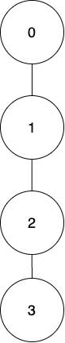
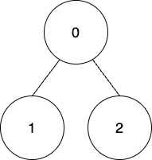

## Problem

There exists an undirected tree rooted at node `0` with `n` nodes labeled from `0` to `n - 1`. You are given a 2D **integer** array `edges` of length `n - 1`, where `edges[i] = [aᵢ, bᵢ]` indicates that there is an edge between nodes `aᵢ` and `bᵢ` in the tree. You are also given a **0-indexed** array `coins` of size `n` where `coins[i]` indicates the number of coins in the vertex `i`, and an integer `k`.

Starting from the root, you have to collect all the coins such that the coins at a node can only be collected if the coins of its ancestors have been already collected.

Coins at `nodeᵢ` can be collected in one of the following ways:

- Collect all the coins, but you will get `coins[i] - k` points. If `coins[i] - k` is negative then you will lose `abs(coins[i] - k)` points.
- Collect all the coins, but you will get `floor(coins[i] / 2)` points. If this way is used, then for all the `nodeⱼ` present in the subtree of `nodeᵢ`, `coins[j]` will get reduced to `floor(coins[j] / 2)`.

Return _the **maximum points** you can get after collecting the coins from **all** the tree nodes._

<https://leetcode.cn/problems/maximum-points-after-collecting-coins-from-all-nodes/>

**Example 1:**

{.invert-when-dark}

> Input: `edges = [[0,1],[1,2],[2,3]], coins = [10,10,3,3], k = 5`
> Output: `11`
> Explanation:
> Collect all the coins from node 0 using the first way. Total points `= 10 - 5 = 5`.
> Collect all the coins from node 1 using the first way. Total points `= 5 + (10 - 5) = 10`.
> Collect all the coins from node 2 using the second way so coins left at node 3 will be `floor(3 / 2) = 1`. Total points `= 10 + floor(3 / 2) = 11`.
> Collect all the coins from node 3 using the second way. Total points `= 11 + floor(1 / 2) = 11`.
> It can be shown that the maximum points we can get after collecting coins from all the nodes is 11.

**Example 2:**

{.invert-when-dark}

> Input: `edges = [[0,1],[0,2]], coins = [8,4,4], k = 0`
> Output: `16`
> Explanation:
> Coins will be collected from all the nodes using the first way. Therefore, total points `= (8 - 0) + (4 - 0) + (4 - 0) = 16`.

**Constraints:**

- `n == coins.length`
- `2 <= n <= 10⁵`
- `0 <= coins[i] <= 10⁴`
- `edges.length == n - 1`
- `0 <= edges[i][0], edges[i][1] < n`
- `0 <= k <= 10⁴`

## Test Cases

```python
class Solution:
    def maximumPoints(self, edges: List[List[int]], coins: List[int], k: int) -> int:
```



## Thoughts

定义 `dp(u, i)` 表示以 u 为根节点的子树，其祖先节点已经执行过 i 次方案二，所能得到的最大 points。显然（其中 v 是 u 的子节点）：

$$
dp(u,i)=\max\begin{cases}
  coins[u]\gg i+\sum_{v}{dp(v,i)} \\
  coins[u]\gg(i+1)+\sum_{v}{dp(v,i+1)}
\end{cases}
$$

即对节点 u 执行方案一或者方案二，二者取大。

考虑到 `coins[u]` 最大值为 10⁴，当 `i ≥ 14` 时，`coins[u]` 就一定为 0 了，所以 i 可以只取 0 到 13。另外 i 也不会超过树的高度，但本题中树的高度可以达到 `O(n)` 量级。

用后序遍历树，处理完所有的子节点后，汇总出中间节点的结果。

这里直接用递归实现。也可以用栈加循环来模拟递归（类似于 [3249. Count the Number of Good Nodes](../3249-count-the-number-of-good-nodes/index.md)），但不一定比直接递归快。

时间复杂度 `O(n * log m)`，其中 m 是 10⁴ 或者 coins 中的最大值，空间复杂度 `O(n * log m)` 或者 `O(h * log m)`，其中 h 是树的高度（平均情况下 `h ≈ O(log n)`）。

## Code


