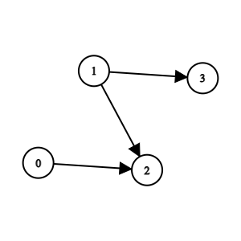

## Problem

There are `n` teams numbered from `0` to `n - 1` in a tournament; each team is also a node in a **DAG**.

You are given the integer `n` and a **0-indexed** 2D integer array `edges` of length `m` representing the **DAG**, where `edges[i] = [uᵢ, vᵢ]` indicates that there is a directed edge from team `uᵢ` to team `vᵢ` in the graph.

A directed edge from `a` to `b` in the graph means that team `a` is **stronger** than team `b` and team `b` is **weaker** than team `a`.

Team `a` will be the **champion** of the tournament if there is no team `b` that is **stronger** than team `a`.

Return _the team that will be the **champion** of the tournament if there is a **unique** champion, otherwise, return_ `-1`_._

**Notes:**

- A **cycle** is a series of nodes `a₁, a₂, ..., aₙ, aₙ₊₁` such that node `a₁` is the same node as node `aₙ₊₁`, the nodes `a₁, a₂, ..., aₙ` are distinct, and there is a directed edge from the node `aᵢ` to node `aᵢ₊₁` for every `i` in the range `[1, n]`.
- A **DAG** is a directed graph that does not have any **cycle**.

<https://leetcode.com/problems/find-champion-ii/>

**Example 1:**





> Input: `n = 3, edges = [[0,1],[1,2]]`
> Output: `0`
> Explanation: Team 1 is weaker than team 0. Team 2 is weaker than team 1. So the champion is team 0.

**Example 2:**





Input: `n = 4, edges = [[0,2],[1,3],[1,2]]`
Output: `-1`
Explanation: Team 2 is weaker than team 0 and team 1. Team 3 is weaker than team 1. But team 1 and team 0 are not weaker than any other teams. So the answer is -1.

**Constraints:**

- `1 <= n <= 100`
- `m == edges.length`
- `0 <= m <= n * (n - 1) / 2`
- `edges[i].length == 2`
- `0 <= edge[i][j] <= n - 1`
- `edges[i][0] != edges[i][1]`
- The input is generated such that if team `a` is stronger than team `b`, team `b` is not stronger than team `a`.
- The input is generated such that if team `a` is stronger than team `b` and team `b` is stronger than team `c`, then team `a` is stronger than team `c`.

## Test Cases

``` python
class Solution:
    def findChampion(self, n: int, edges: List[List[int]]) -> int:
```



## Thoughts

跟 [2923. Find Champion I](/coding/2923-find-champion-i) 差不多。

冠军组的入度为 0。扫描所有的边，记录入度大于零的节点，剩下的就是入度为 0 的节点。如果刚好只有一个，那就是冠军组，否则没有冠军组。

时间复杂度 `O(n + m)`，空间复杂度 `O(n)`。

## Code


