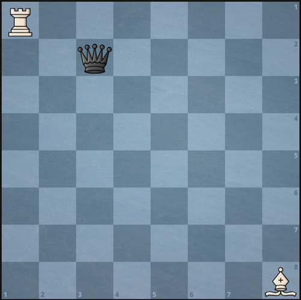

## Problem

There is a **1-indexed** `8 x 8` chessboard containing `3` pieces.

You are given `6` integers `a`, `b`, `c`, `d`, `e`, and `f` where:

- `(a, b)` denotes the position of the white rook.
- `(c, d)` denotes the position of the white bishop.
- `(e, f)` denotes the position of the black queen.

Given that you can only move the white pieces, return _the **minimum** number of moves required to capture the black queen_.

**Note** that:

- Rooks can move any number of squares either vertically or horizontally, but cannot jump over other pieces.
- Bishops can move any number of squares diagonally, but cannot jump over other pieces.
- A rook or a bishop can capture the queen if it is located in a square that they can move to.
- The queen does not move.

<https://leetcode.cn/problems/minimum-moves-to-capture-the-queen/>

**Example 1:**



> Input: `a = 1, b = 1, c = 8, d = 8, e = 2, f = 3`
> Output: `2`
> Explanation: We can capture the black queen in two moves by moving the white rook to `(1, 3)` then to `(2, 3)`.
> It is impossible to capture the black queen in less than two moves since it is not being attacked by any of the pieces at the beginning.

**Example 2:**


> Input: `a = 5, b = 3, c = 3, d = 4, e = 5, f = 2`
> Output: `1`
> Explanation: We can capture the black queen in a single move by doing one of the following:
>
> - Move the white rook to `(5, 2)`.
> - Move the white bishop to `(5, 2)`.

**Constraints:**

- `1 <= a, b, c, d, e, f <= 8`
- No two pieces are on the same square.

## Test Cases

``` python
class Solution:
    def minMovesToCaptureTheQueen(self, a: int, b: int, c: int, d: int, e: int, f: int) -> int:
```



## Thoughts

如果没有 bishop，显然 rook 最多两步可以抓到 queen。如果 rook 跟 queen 不在同一行或列，单个 bishop 无法同时挡住 rook 的两条路线，依然是两步杀。如果 rook 跟 queen 在同一行或列，而 bishop 刚好挡在中间，则第一步让 bishop 随便挪走，下一步让 rook 抓到 queen。

所以任何情况最多只需要两步。

一步杀只有两种可能。一种是 rook 跟 queen 在同一行或列，且 bishop 没挡在中间。另一种是 bishop 跟 queen 在同一条斜线（根据 [51. N-Queens](../51-n-queens/index.md) 可知同一斜线的条件是行列之和相等或之差相等），且 rook 没挡在中间。

## Code


