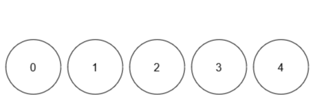

## Problem

You are given an integer `limit` and a 2D array `queries` of size `n x 2`.

There are `limit + 1` balls with **distinct** labels in the range `[0, limit]`. Initially, all balls are uncolored. For every query in `queries` that is of the form `[x, y]`, you mark ball `x` with the color `y`. After each query, you need to find the number of **distinct** colors among the balls.

Return an array `result` of length `n`, where `result[i]` denotes the number of distinct colors _after_ `iᵗʰ` query.

**Note** that when answering a query, lack of a color _will not_ be considered as a color.

<https://leetcode.com/problems/find-the-number-of-distinct-colors-among-the-balls/>

**Example 1:**

> Input: `limit = 4, queries = [[1,4],[2,5],[1,3],[3,4]]`
> Output: `[1,2,2,3]`
> Explanation:
> 


>
> - After query 0, ball 1 has color 4.
> - After query 1, ball 1 has color 4, and ball 2 has color 5.
> - After query 2, ball 1 has color 3, and ball 2 has color 5.
> - After query 3, ball 1 has color 3, ball 2 has color 5, and ball 3 has color 4.

**Example 2:**

> Input: `limit = 4, queries = [[0,1],[1,2],[2,2],[3,4],[4,5]]`
> Output: `[1,2,2,3,4]`
> Explanation:
> 


>
> - After query 0, ball 0 has color 1.
> - After query 1, ball 0 has color 1, and ball 1 has color 2.
> - After query 2, ball 0 has color 1, and balls 1 and 2 have color 2.
> - After query 3, ball 0 has color 1, balls 1 and 2 have color 2, and ball 3 has color 4.
> - After query 4, ball 0 has color 1, balls 1 and 2 have color 2, ball 3 has color 4, and ball 4 has color 5.

**Constraints:**

- `1 <= limit <= 10⁹`
- `1 <= n == queries.length <= 10⁵`
- `queries[i].length == 2`
- `0 <= queries[i][0] <= limit`
- `1 <= queries[i][1] <= 10⁹`

## Test Cases

``` python
class Solution:
    def queryResults(self, limit: int, queries: List[List[int]]) -> List[int]:
```



## Thoughts

需要记录每个球的颜色，以及每个颜色的球数。后者用字典，并在某个颜色的球数归零时将 key 删掉，就可以用 `O(1)` 时间获取各不相同的颜色总数。

对于每个 query，给被涂色的球的原来的颜色的球数减一，新颜色的球数加一，并记录该球最后的颜色。

记录每个球的颜色可以用数组，也可以用字典，考虑到本题 limit 的量级为 `10⁹`，而 queries 的量级（n）为 `10⁵`，也就是说最多只有 n 个球会被涂色，用字典的空间占用更低。

时间复杂度 `O(n)`，空间复杂度 `O(n)`。

## Code


