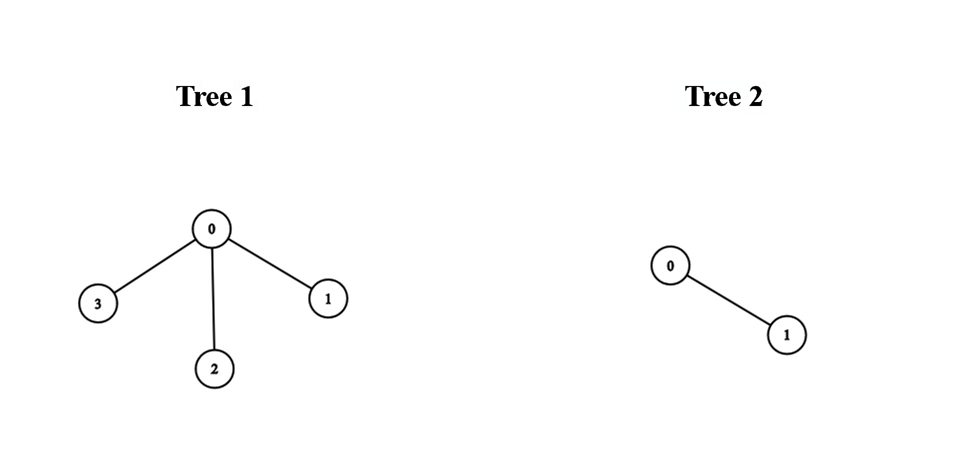
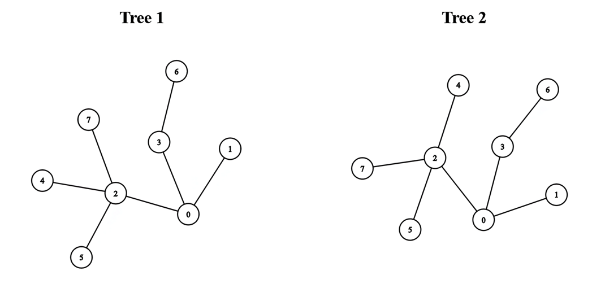

## Problem

There exist two **undirected** trees with `n` and `m` nodes, numbered from `0` to `n - 1` and from `0` to `m - 1`, respectively. You are given two 2D integer arrays `edges1` and `edges2` of lengths `n - 1` and `m - 1`, respectively, where `edges1[i] = [aᵢ, bᵢ]` indicates that there is an edge between nodes `aᵢ` and `bᵢ` in the first tree and `edges2[i] = [uᵢ, vᵢ]` indicates that there is an edge between nodes `uᵢ` and `vᵢ` in the second tree.

You must connect one node from the first tree with another node from the second tree with an edge.

Return the **minimum** possible **diameter** of the resulting tree.

The **diameter** of a tree is the length of the _longest_ path between any two nodes in the tree.

<https://leetcode.com/problems/find-minimum-diameter-after-merging-two-trees/>

**Example 1:**





> Input: `edges1 = [[0,1],[0,2],[0,3]], edges2 = [[0,1]]`
> Output: `3`
> Explanation:
> We can obtain a tree of diameter 3 by connecting node 0 from the first tree with any node from the second tree.





**Example 2:**

> Input: `edges1 = [[0,1],[0,2],[0,3],[2,4],[2,5],[3,6],[2,7]], edges2 = [[0,1],[0,2],[0,3],[2,4],[2,5],[3,6],[2,7]]`
> Output: `5`
> Explanation:
> We can obtain a tree of diameter 5 by connecting node 0 from the first tree with node 0 from the second tree.

**Constraints:**

- `1 <= n, m <= 10⁵`
- `edges1.length == n - 1`
- `edges2.length == m - 1`
- `edges1[i].length == edges2[i].length == 2`
- `edges1[i] = [aᵢ, bᵢ]`
- `0 <= aᵢ, bᵢ < n`
- `edges2[i] = [uᵢ, vᵢ]`
- `0 <= uᵢ, vᵢ < m`
- The input is generated such that `edges1` and `edges2` represent valid trees.

## Test Cases

``` python
class Solution:
    def minimumDiameterAfterMerge(self, edges1: List[List[int]], edges2: List[List[int]]) -> int:
```



## Thoughts

在两棵树中分别找到最长的的路径（也就是直径），取正中的点（如果正中有两个点，就任取一个），用新的边连起来，这样构造出来的新树的直径是最小的。

设两棵树的直径分别是 d1 和 d2，那么新树的直径是 `min{d1, d2, 1 + ⌈d1/2⌉ + ⌈d2/2⌉}`。

求一棵无向树的直径，可以从任一顶点出发，遍历树并找到距离最远的点，再从这个点出发找到距离最远的点以及距离，这个距离就是树的直径。时间复杂度 `O(n)`。

总的时间复杂度 `O(m + n)`，空间复杂度 `O(m + n)`。

## Code


