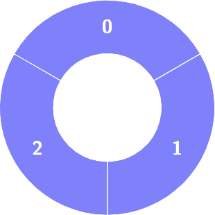
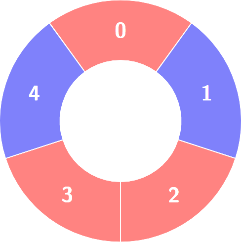
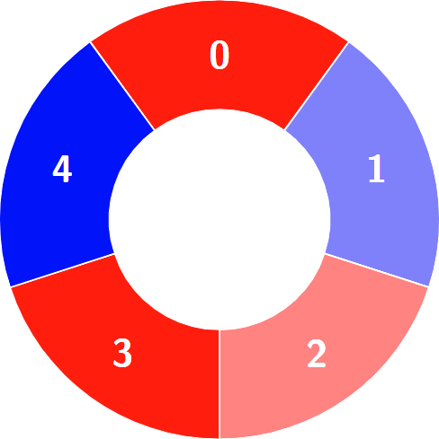
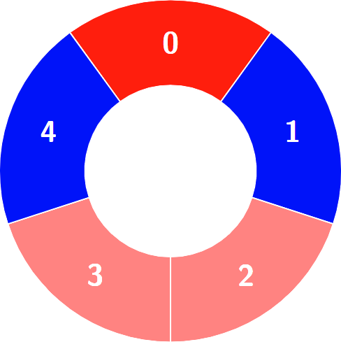
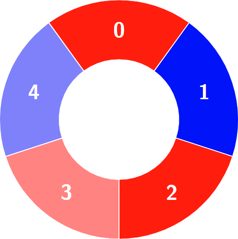

## Problem

There is a circle of red and blue tiles. You are given an array of integers `colors`. The color of tile `i` is represented by `colors[i]`:

- `colors[i] == 0` means that tile `i` is **red**.
- `colors[i] == 1` means that tile `i` is **blue**.

Every 3 contiguous tiles in the circle with **alternating** colors (the middle tile has a different color from its **left** and **right** tiles) is called an **alternating** group.

Return the number of **alternating** groups.

**Note** that since `colors` represents a **circle**, the **first** and the **last** tiles are considered to be next to each other.

<https://leetcode.cn/problems/alternating-groups-i/>

**Example 1:**

> Input: `colors = [1,1,1]`
> Output: `0`
> Explanation:
> 

**Example 2:**

> Input: `colors = [0,1,0,0,1]`
> Output: `3`
> Explanation:
> 
> Alternating groups:
> 
<!-- cell -->
> 
<!-- cell -->
> 
<!-- cell -->
> 


**Constraints:**

- `3 <= colors.length <= 100`
- `0 <= colors[i] <= 1`

## Test Cases

``` python
class Solution:
    def numberOfAlternatingGroups(self, colors: List[int]) -> int:
```



## Thoughts

直接遍历一遍即可。用 Python 的话，可以利用其负数数组下标简化边界处理。

## Code


