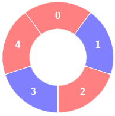
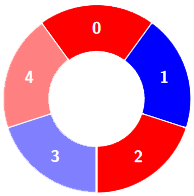
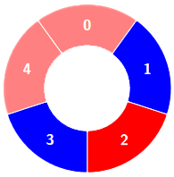
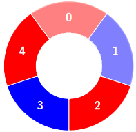
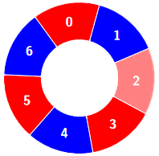
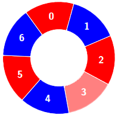

## Problem

There is a circle of red and blue tiles. You are given an array of integers `colors` and an integer `k`. The color of tile `i` is represented by `colors[i]`:

- `colors[i] == 0` means that tile `i` is **red**.
- `colors[i] == 1` means that tile `i` is **blue**.

An **alternating** group is every `k` contiguous tiles in the circle with **alternating** colors (each tile in the group except the first and last one has a different color from its **left** and **right** tiles).

Return the number of **alternating** groups.

**Note** that since `colors` represents a **circle**, the **first** and the **last** tiles are considered to be next to each other.

<https://leetcode.cn/problems/alternating-groups-ii/>

**Example 1:**

> Input: `colors = [0,1,0,1,0], k = 3`
> Output: `3`
> Explanation:
> 
> Alternating groups:
> 
<!-- cell -->
> 
<!-- cell -->
> 
<!-- cell -->
> 


**Example 2:**

> Input: `colors = [0,1,0,0,1,0,1], k = 6`
> Output: `2`
> Explanation:
> 
> Alternating groups:
> 
<!-- cell -->
> 
<!-- cell -->
> 


**Example 3:**

> Input: `colors = [1,1,0,1], k = 4`
> Output: `0`
> Explanation:
> 

**Constraints:**

- `3 <= colors.length <= 10⁵`
- `0 <= colors[i] <= 1`
- `3 <= k <= colors.length`

## Test Cases

``` python
class Solution:
    def numberOfAlternatingGroups(self, colors: List[int], k: int) -> int:
```



## Thoughts

[3206. Alternating Groups I](3206-alternating-groups-i) 的进阶版，k 从固定的 3 变成任意值。

直接按同样的方式做，时间复杂度是 `O(n * k)`。其中有很多判定是重复的。

假设已经找到一个长度为 k 的交替组，如果下一个 tile 的颜色跟当前组最后一个 tile 的颜色不同，说明整体右移一格依然是长度为 k 的交替组。否则就从下一个 tile 开始，重新找到下一个 k-交替组。

找 k-交替组的过程是一样的，记录当前已经符合交替要求的连续 tiles 个数，如果下一个 tile 跟当前组最后一个 tile 颜色不同，则 tiles 个数加一，否则从下一个 tile 开始重新计数。

利用 Python 负数下标简化边界处理。

时间复杂度 `O(n + k)`。

## Code


